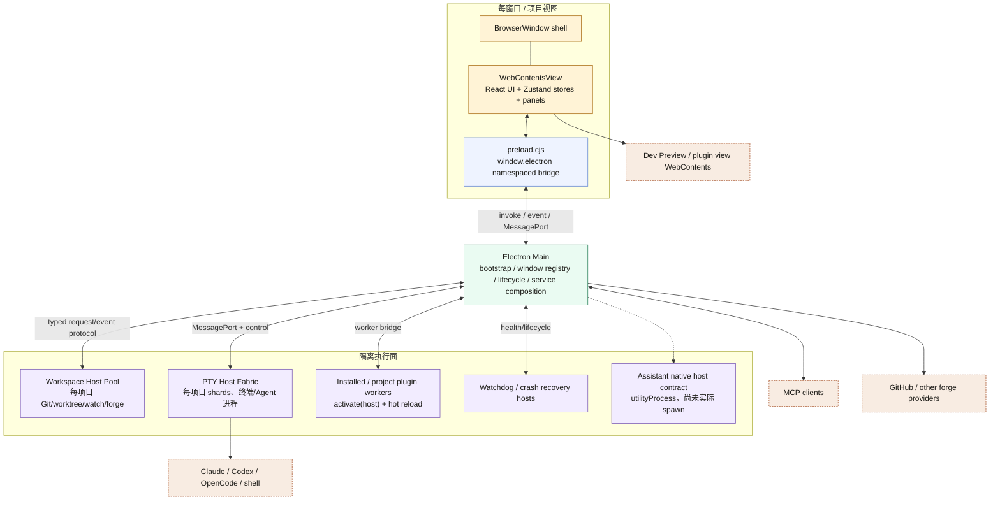
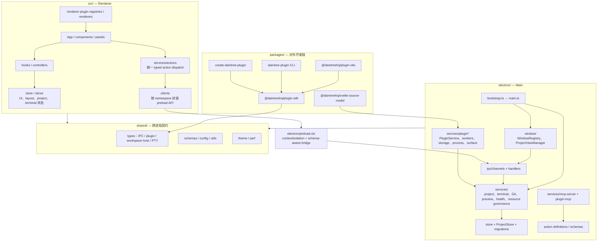
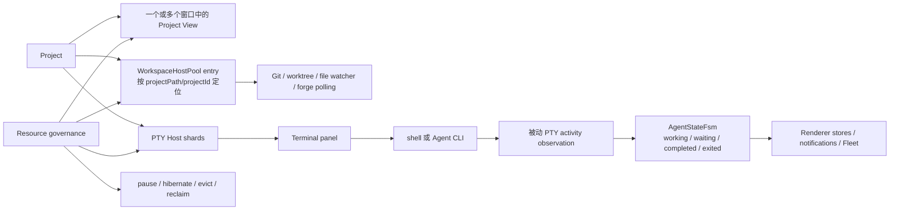
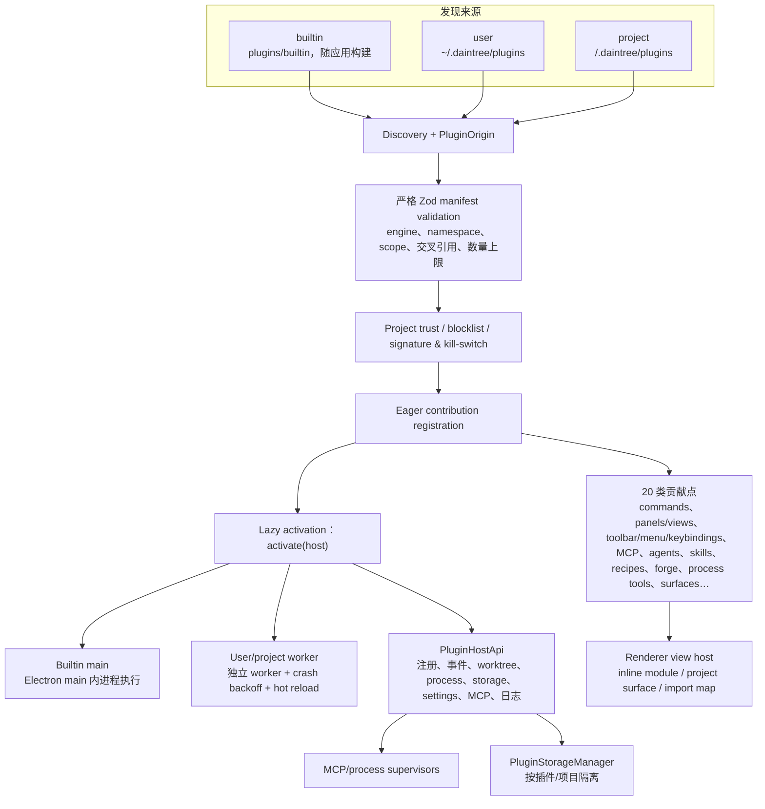
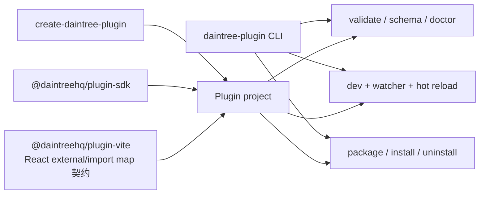
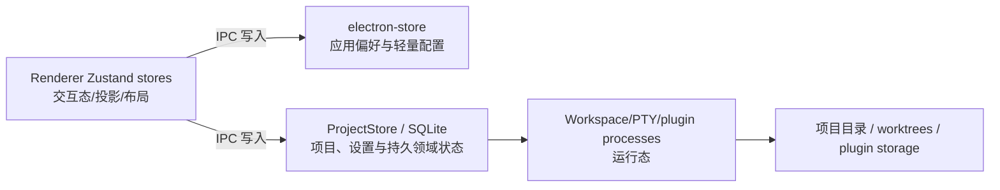

# Daintree 静态结构图

> 代码快照：`b48d2f8e1544a4e3eeaae9137e57f4a48bf6823c`  
> 源码位置：`/Users/chrischiang/Projects/GitHubProjects/dozer-v2/daintreehq/daintree`  
> 整理日期：2026-09-25  
> 性质：根据当前源码、package/workspace 清单和仓库内架构文档绘制的现状图，不是目标架构推演。

## 1. 阅读约定

Daintree 是 Electron + React/TypeScript IDE。其关键结构不是传统“三层应用”，而是 Electron 主进程
作为 authority，按项目和资源类型把高风险/高负载工作分散到多个 `utilityProcess`/worker；renderer
通过 preload 暴露的窄 IPC 接口访问服务。

- 蓝色：共享契约与 bridge；
- 绿色：主进程服务；
- 金色：用户界面；
- 紫色：隔离的执行进程；
- 橙色虚线：外部程序/服务。

## 2. 运行时进程与 IPC 拓扑

这里存在三类 IPC：renderer ↔ main 的 Electron invoke/event，main ↔ utility process 的结构化消息，
以及 PTY/高频数据使用的 `MessagePort` 通道。`BrowserWindow` 只是壳，React 应用实际装在
`WebContentsView` 中；多窗口状态不能通过隐含的进程全局“当前窗口”定位。

## 3. 源码静态分层

Renderer 的 action system 是菜单、快捷键、context menu、command palette 与 Agent automation 的公共
调度层；Main services 是能力 authority；`shared/types` 是二者及子进程之间的契约层。preload 不承载
业务逻辑，只把经过约束的 namespace 暴露给 renderer。

## 4. 项目、终端与 Agent 运行结构

终端身份是单一 PTY-backed panel，普通 shell 与 Agent 是运行态差异，而非两套终端类型。Agent 状态
主要从 PTY 输出和进程活动被动推断；workspace host 与 PTY host 都按项目隔离，并由资源治理策略做
预热、暂停、休眠、回收和故障重启。

## 5. 插件系统静态结构

插件有 `builtin | user | project` 三种 origin。Builtin main 在 Electron Main 内执行；用户安装和项目
插件的 `activate()` 在独立 worker 中执行。声明的 capability 主要用于披露和 Host policy 输入，并不
等价于操作系统级沙箱；真正的安全约束来自 Host API、scope、信任闸门、进程参数和 Main 侧校验。

### 开发与发布链

## 6. 持久化与权威边界

Renderer store 不是跨进程事实源；项目、终端和插件操作都要通过 Main 重新定位 scope 并校验。应用偏好
与项目/领域数据使用不同存储路径，迁移机制也分开管理。

## 7. 结构判断

- Electron Main 是窗口、scope、插件、进程与持久化的 authority；renderer 是投影和交互层。
- Daintree 的 daemon 能力不是单一后台进程，而是由 Main 管理的 workspace host、PTY host、插件
  worker、watchdog 等多种隔离进程组成。
- “按项目隔离”贯穿 renderer view、workspace host、PTY shard、project plugin 和 storage scope，
  是多窗口正确性的主轴。
- 插件系统已经覆盖 schema、SDK、CLI、dev loop、热加载、贡献点、trust preview、进程与存储；但
  capability 声明不是强沙箱保证。
- 内置 GitHub 和 SvelteKit 能力也使用插件契约，证明插件不是只给第三方的外围机制；同时 builtin
  在 Main 内执行，信任等级显著高于 installed/project worker。

## 8. 主要代码证据

- `docs/architecture/process-and-window-model.md`：进程、窗口与三类 IPC；
- `electron/bootstrap.ts`、`electron/main.ts`、`electron/window/`：启动、窗口与服务组合；
- `electron/preload.cts`、`electron/ipc/`、`src/clients/`：renderer/Main bridge；
- `electron/services/workspace-client/WorkspaceHostPool.ts`、`electron/services/WorkspaceHostProcess.ts`：
  每项目 workspace host；
- `docs/architecture/pty-host-fabric.md`、`electron/pty-host/`、`electron/services/pty/`：PTY 分片执行面；
- `src/services/actions/`、`docs/architecture/action-system.md`：统一 action/MCP surface；
- `electron/services/plugin/`、`electron/services/plugin-mcp/`、`shared/types/plugin.ts`、
  `electron/schemas/plugin.ts`：插件生命周期、Host API 与契约；
- `packages/{plugin-sdk,plugin-vite,daintree-plugin,create-daintree-plugin}/`：插件开发工具链；
- `docs/plugins/{architecture,trust-model,contribution-points,dev-loop}.md`：插件现状与边界。
