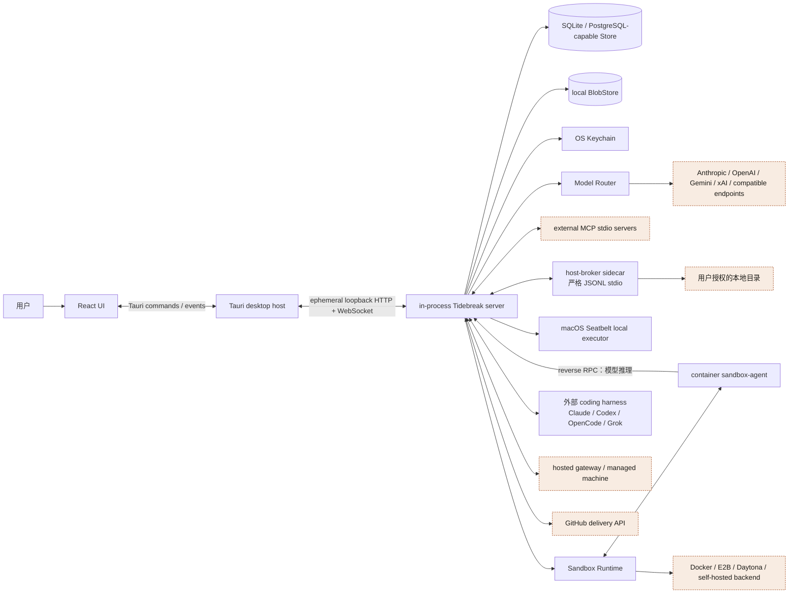
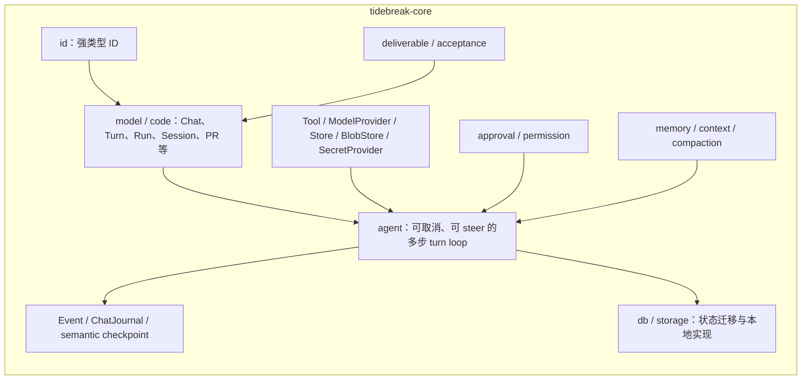
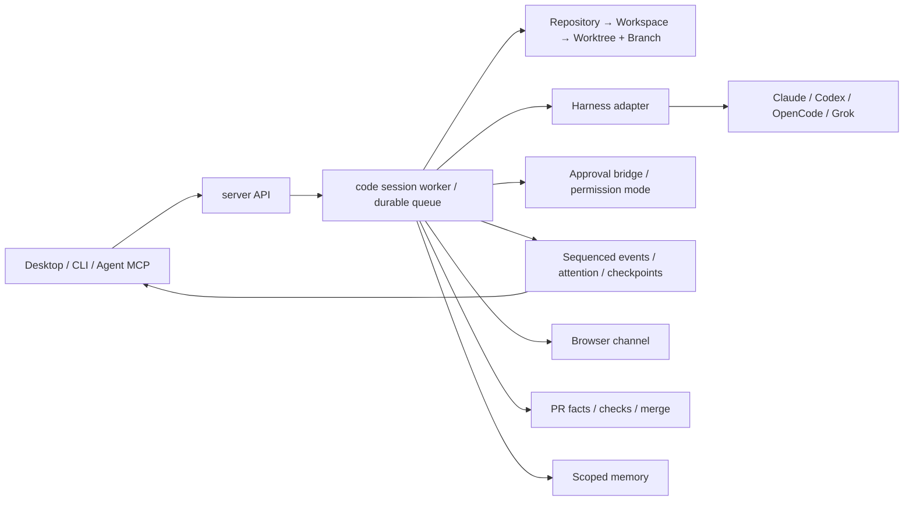

# Tidebreak 静态结构图

> 代码快照：`3253a4d3a3eacc4757a521856dc5a56c9dd32f5e`  
> 源码位置：`/Users/chrischiang/Projects/GitHubProjects/dozer-v2/brightwave-inc/tidebreak`  
> 整理日期：2026-09-25  
> 性质：根据当前源码、Cargo 清单和仓库内架构文档绘制的现状图，不是目标架构推演。

## 1. 阅读约定

Tidebreak 是 Rust workspace，桌面端由 Tauri + React/TypeScript 构成。仓库明确规定依赖只能向
`tidebreak-core` 下沉：库不得依赖客户端，客户端负责组合库。以下将“编译期依赖”和“运行时调用”
分开绘制。

- 蓝色：共享契约或基础库；
- 绿色：服务与运行时库；
- 金色：可执行客户端；
- 橙色：进程外、远端或第三方系统。

## 2. Workspace 编译结构

```mermaid
flowchart TB
  subgraph clients["客户端 / 可执行程序"]
    desktop["tidebreak-desktop\nTauri 宿主 + React UI"]
    cli["tidebreak-cli\nheadless daemon + CLI"]
    sandbox_agent["tidebreak-sandbox-agent\n容器内 Agent"]
    supervised["tidebreak-supervised-agent\n外部监督型 Agent"]
  end

  api["tidebreak-server-api\nHTTP / WebSocket routes"]
  server["tidebreak-server-core\n本地 API、workers、code mode 编排"]

  subgraph runtime["领域与运行时库"]
    router["tidebreak-router\n模型适配与路由"]
    mcp["tidebreak-mcp\nMCP server/client"]
    harness["tidebreak-harness\nClaude/Codex/OpenCode/Grok 事件归一"]
    execution["tidebreak-code-execution\n本地/容器/E2B/Daytona 执行"]
    remote["tidebreak-code-remote\n远端 runtime 控制"]
    delivery["tidebreak-code-delivery\nGitHub PR/workflow/deployment"]
    sandbox_runtime["tidebreak-sandbox-runtime\n后台 Agent 与容器生命周期"]
    gateway["tidebreak-gateway-runtime\n模型网关会话与 relay"]
  end

  subgraph boundaries["独立边界与策略库"]
    host_broker["tidebreak-host-broker\n受授权的本机访问边界"]
    sandbox_protocol["tidebreak-sandbox-protocol\n版本化 sandbox wire contract"]
    shell_policy["tidebreak-shell-policy\n纯函数 shell 风险判定"]
    egress["tidebreak-egress\ndeny-by-default 出网策略"]
    worker["tidebreak-worker-runtime\n持久 worker 节奏/重试"]
    managed_node["tidebreak-managed-node\n受管 Node 校验契约"]
  end

  core["tidebreak-core\nAgent loop、领域模型、Tool/Provider/Store 契约、SQLite"]

  desktop --> api
  desktop --> host_broker
  cli --> api
  api --> server
  server --> router
  server --> mcp
  server --> harness
  server --> execution
  server --> remote
  server --> delivery
  server --> sandbox_runtime
  server --> gateway
  sandbox_agent --> sandbox_protocol
  sandbox_agent --> core
  supervised --> harness
  supervised --> core
  execution --> egress
  sandbox_runtime --> sandbox_protocol

  router --> core
  mcp --> core
  harness --> core
  execution --> core
  remote --> core
  delivery --> core
  sandbox_runtime --> core
  gateway --> core

  class core,host_broker,sandbox_protocol,shell_policy,egress,worker,managed_node foundation;
  class api,server,router,mcp,harness,execution,remote,delivery,sandbox_runtime,gateway service;
  class desktop,cli,sandbox_agent,supervised client;
  classDef foundation fill:#eef3ff,stroke:#5b7fd1,color:#1c1b17;
  classDef service fill:#eafbf2,stroke:#1f7a52,color:#1c1b17;
  classDef client fill:#fff3d6,stroke:#a8690f,color:#1c1b17;
```

说明：图只画主要依赖方向；完整依赖仍以各 crate 的 `Cargo.toml` 为准。`tidebreak-whisper` 是独立
workspace，被根 workspace 排除，由桌面端按需启动。

## 3. 运行时部署拓扑

桌面程序把 server 编译进同一进程，但 renderer 只通过 Tauri 和 loopback API 接触能力；本机文件、
沙箱和远端执行各自保留独立授权/协议边界，不能因部署在本机而视为同一信任域。

## 4. 核心内部结构

`tidebreak-core` 同时承载稳定契约、Agent loop、领域模型与默认本地存储，是整个 workspace 的开源
接缝。具体模型厂商适配位于 `tidebreak-router`，外部 coding engine 的协议翻译位于
`tidebreak-harness`，避免 core 反向依赖具体供应商。

## 5. Code Mode 结构

Code Mode 没有复用进程内模型 loop，而是复用 job、lease、事件序列和审批形状，并在
`tidebreak-harness` 后驱动外部 Agent CLI。workspace/worktree/session 是持久身份，PTY 或 engine
子进程只是可恢复的运行资源。

## 6. 结构判断

- 最稳定的中心是 `tidebreak-core` 的契约与持久状态，不是某个 UI 或执行后端。
- `tidebreak-server-core` 是当前最大的组合根：API workers、Code Mode、审批、执行、MCP、网关和交付
  都在此汇合；它是能力编排层，不应被误画成纯 HTTP server。
- 安全边界被拆成可单测的纯策略（shell/egress）、版本化协议（sandbox protocol）和有状态 broker，
  再由 server/desktop 组合。
- 沙箱内 Agent 不持有模型凭据，推理通过 reverse RPC 回到 Host；Tidebreak 也不主动拨入远端 pod。
- 桌面与 CLI 是同一 server 能力的不同客户端，核心运行时并不归属于桌面 UI。

## 7. 主要代码证据

- `Cargo.toml`：`members = ["crates/*"]`，并排除 `tidebreak-whisper`；
- `docs/crates.md`：官方 crate 分层与依赖约束；
- `crates/tidebreak-core/src/{agent,model,db,storage,tool,provider}.rs`：核心契约与状态；
- `crates/tidebreak-server/src/` 与 `crates/tidebreak-server-api/src/`：worker/编排与 route 分层；
- `crates/tidebreak-desktop/src/`、`crates/tidebreak-desktop/ui/`：Tauri Host 与 React UI；
- `crates/tidebreak-harness/src/{claude,codex,opencode,grok}/`：外部 engine adapter；
- `crates/tidebreak-sandbox-{protocol,runtime,agent}/`：Host/沙箱协议与执行两侧；
- `docs/how-tidebreak-works.md`、`docs/code-mode.md`、`docs/gateway-boundary.md`：运行时流程与边界。
