# Dozer V2 静态结构图

> 文档性质：对 `dozer-v2架构分析.md` 与 `dozer-v2开源生态调研.md` 的结构化映射，用于讨论落点，
> 不是已批准的实现规格。crate/模块/文件命名为基于两份文档描述的合理推演。
> 整理日期：2026-09-24；2026-09-25 依据 `dozer-v2静态结构图-审核意见.md` 做结构重排与部分内容修订
> （见文末「X. 审核意见采纳情况」，审核意见中与当前仓库实际不符的具体断言未采纳，仅采纳其指出的
> 真实缺口）；2026-09-26 追加多语言（i18n）相关节点，对应架构分析 §19。也发布为 Claude Artifact
> （交互版，浅色卡片背景保证 Mermaid 图在深浅主题下都可读）：
> https://claude.ai/artifact/Q25RQ9iAWMJe2kyKZFFqjv （尚未同步本轮修订，以本文件为准）。

细化到 package / crate / module / 文件级，并附数据库结构。两层拆分原则见架构分析 §4.2：
「领域数据应由插件自己的存储或 namespaced service 持有，核心 daemon 只提供通用托管能力」。

## 如何阅读本图（2026-09-25 改版说明）

本版按「**基座**」与「**面板 / 组件**」两大部分重新组织，取代此前按 crate 逐一平铺（A-I）的顺序：

- **基座**：不属于任何单一面板、被所有面板共享或依赖的部分——workspace 全景、Host 壳层
  （窗口/Rail/Tab/Surface 挂载点）、`dozerd` 内核（Workflow Kernel/Supervisor/权限/事件）、
  `dozer-protocol` 契约、MCP Gateway、Execution Environment/Decision Service、核心数据库。
- **面板 / 组件**：架构分析 §17-§18 列出的每个具体面板或新页面（Mission、Delivery、Decision
  Inbox、Todo、Project、Code Health……），描述其定位、现状文件、目标插件形态（如适用）与私有
  数据。同一 crate 的内容可能被拆到多个面板小节中引用，不再要求「一个 crate 一张图」。

节点颜色约定（各图 `classDef`）：绿 = 现状基本保留；金 = 既有 crate/bin，职责大幅演进；
蓝 = V2 全新 crate/模块（规划中）；橙虚线 = 从现有 `extensions::*` 拆出的进程外插件，或待迁出的 legacy 模块。
**箭头语义提示：** 下方 Mermaid 图混合表达了「编译依赖」「进程间调用」「逻辑提供/基于」三类关系，
统一拆成三张独立图（依赖图/部署拓扑图/运行时调用图）是审核意见 4.2 的合理建议，但本轮修订认为
一次性重画代价较高、且当前阶段读者主要靠图例和随文说明消歧，故本版仅在容易引起误读的箭头旁加了
文字澄清，未拆图；留作下一轮修订的候选项（见文末 X 节「未采纳」部分）。

## 目录

**基座（Platform Foundation）**

- [A. Workspace Crate 全景](#a-workspace-crate-全景)
- [B. Micro Host 骨架（dozer-host，原 dozer-app）](#b-micro-host-骨架dozer-host原-dozer-app)
- [C. Platform Services Daemon（dozerd）](#c-platform-services-daemondozerd)
- [D. dozer-protocol（内核契约）](#d-dozer-protocol内核契约)
- [E. MCP Gateway（dozer-mcp）](#e-mcp-gatewaydozer-mcp)
- [F. Execution Environment / Decision Service](#f-execution-environment--decision-service)
- [G. 核心 Workflow Kernel 数据库](#g-核心-workflow-kernel-数据库dozerd--storagecore_dbrs)

**面板 / 组件（Panels & Components）**

- [H. Mission / Overview](#h-mission--overview)
- [I. Delivery / Acceptance](#i-delivery--acceptance)
- [J. Decision Inbox](#j-decision-inbox)
- [K. Runs / Executions（原 Agent 面板）](#k-runs--executions原-agent-面板)
- [L. Todo → Tasks](#l-todo--tasks)
- [M. Project → Project Context（含 Shared Memory）](#m-project--project-context含-shared-memory)
- [N. Code Health → Quality Governance](#n-code-health--quality-governance)
- [O. Conversations → Execution Audit](#o-conversations--execution-audit)
- [P. Usage → Cost & Efficiency](#p-usage--cost--efficiency)
- [Q. Browser → Browser Test & Evidence](#q-browser--browser-test--evidence)
- [R. Files → Worktree-aware Changes](#r-files--worktree-aware-changes)
- [S. Git Log / History → Integration](#s-git-log--history--integration)
- [T. SSH → Environments](#t-ssh--environments)
- [U. Database → Data Workspace](#u-database--data-workspace)
- [V. Plugin Manager / Settings / Footbar](#v-plugin-manager--settings--footbar)
- [W. 插件私有数据库总览](#w-插件私有数据库总览)

- [X. 审核意见采纳情况（本次修订说明）](#x-审核意见采纳情况本次修订说明)

---

# 基座（Platform Foundation）

## A. Workspace Crate 全景

V2 目标下的整体 workspace 构成：现有基座保留，`dozer-core` 之上新增 `dozer-protocol` 承载
Plugin Protocol 与 Workflow Kernel 契约；`dozerd`／`dozer-app`／`dozer-mcp` 三个既有 bin
职责大幅演进；官方 Vibe Coding Suite（架构分析 §2.4）以进程外插件形式挂在 Plugin Runtime
之下，通过 Plugin Protocol 和 MCP 两条通道分别对接 Host 与 Agent。

`dozer-core`/`dozer-client`/`byteui`/`dozer-hook`/`dozer-codehealth` 均为当前 workspace
（`crates/`）已存在的真实 crate，标蓝准确；其余为 V2 新增或大幅演进的推演节点。

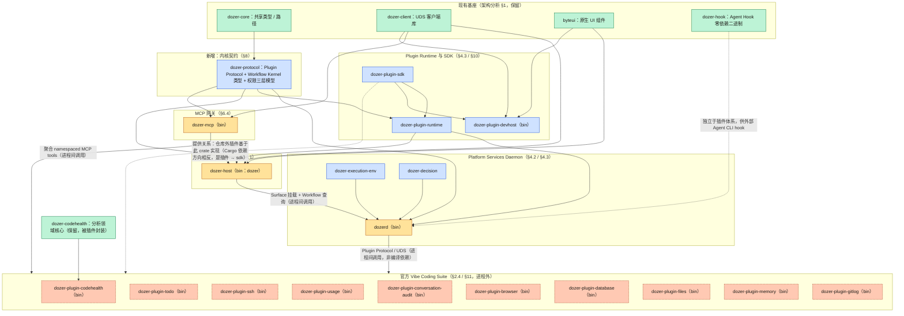

**两条不同的迁移顺序，含义不同（回应审核意见 4.4）：**

- **纵向试点顺序**（架构分析 §11.2-§11.4，验证协议与运行时能力）：Code Health → Todo → SSH。
- **正式能力迁移顺序**（架构分析 §18.16，前提是 Workflow 主模型先稳定）：Code Health → Usage →
  Conversations → Todo → Browser → Database → SSH。

两者可以同时成立但不是同一件事：前者是"先用三个领域跑通协议本身"，后者是"主模型稳定后按什么
顺序把剩余官方能力迁完"。`dozer-plugin-files` 与 `dozer-plugin-gitlog` 保持"查看/验收优先"定位
（§18.8/§18.9），不演化为通用编辑器。

---

## B. Micro Host 骨架 — `dozer-host`（原 `dozer-app`）

iced Shell 继续承担窗口、Workspace、布局与可信 UI（§4.1）。`extensions/*` 迁出后，Host
新增 Plugin Surface、Contribution Registry 与 `supervisor_client/`；具体面板/新页面（Mission、
Delivery、Decision Inbox、Runs 等）不再画进这张"骨架图"，各自在下方对应面板小节展开。

**本节路径已对照 2026-09-25 的实际仓库（`crates/dozer-app/src/`）重新核对**（回应审核意见
4.3）：原版部分文件路径是基于文档描述的推演，与当前代码不完全一致（例如 `app/message.rs`、
`app/update.rs` 审核意见误判为不存在，实际两者都存在；而 `workspace/tabs.rs`、
`workspace/panel_container.rs`、`term/pty_view.rs`、`chrome/cdp_driver.rs` 审核意见判断
准确——当前仓库确实没有这些文件）。下图按核对结果更新。

```mermaid
flowchart LR
  subgraph app_mod["app/（顶层状态机，保留，路径已核对）"]
    direction TB
    app_message["message.rs"]
    app_update["update.rs"]
    app_view["view.rs"]
    app_state["state.rs"]
  end

  subgraph workspace_mod["workspace/（Workspace 状态，保留但比推演薄）"]
    direction TB
    ws_state["state.rs"]
    ws_view["view.rs"]
    ws_hook["hook.rs"]
  end

  subgraph chrome_mod["chrome/（Rail・Tab・Topbar，现状即在此，非 workspace/ 下）"]
    direction TB
    ch_rail["rail.rs"]
    ch_tabs["tab_widget.rs"]
    ch_topbar["topbar.rs"]
    ch_menu["menu.rs · native_menu.rs"]
  end

  subgraph platform_mod["platform/（窗口・原生输入・Overlay，保留）"]
    direction TB
    pf_window["window.rs"]
    pf_events["window_events.rs"]
    pf_overlay["overlay_window.rs · overlay_focus.rs"]
    pf_overlays_misc["confirm/search/settings/… 等 10+ 个 overlay 模块（现状即已按场景各自成文件， 不是单一 native_input.rs）"]
  end

  subgraph surfaces_mod["surfaces/（新增，§7.3-§7.5）"]
    direction TB
    sf_lifecycle["lifecycle.rs"]
    sf_declarative["declarative.rs：Surface A"]
    sf_webview["webview.rs：Surface B"]
    sf_external["external.rs：Surface C"]
    sf_none["（Surface D = None：纯 MCP/后台任务插件，无 UI，不进入 Surface 生命周期， 不单独成文件，见架构分析 §7.3 D）"]
  end

  subgraph registry_mod["registry/（新增，§16.3，覆盖全部贡献类型）"]
    direction TB
    reg_contribution["contribution.rs：统一 ContributionId"]
    reg_panel["panel_registry.rs：Panel/Page/Tab（展示名为 title_key+title_fallback 结构， 查表逻辑走 D 节 dozer-protocol::i18n，架构分析 §19.4）"]
    reg_command["command_registry.rs：Command（展示名同样是 title_key+title_fallback）"]
    reg_other["其余贡献类型（Verifier、MCP tool/resource/prompt、 Background job、Data source、Context provider、Artifact renderer）暂共用 contribution.rs 的通用索引，未各自拆文件，见 §16.3 全量列表"]
  end

  subgraph supervisor_mod["supervisor_client/（新增，§4.3；仅「请求 + 展示」，不持有插件生命周期权威）"]
    direction TB
    sup_client["plugin_client.rs：向 dozerd 请求安装/启停/升级/重启"]
    sup_permission["permission_prompt.rs：展示 dozerd 下发的权限申请"]
  end

  subgraph theme_assets_mod["theme/ · assets/ · term/ · tabular/（保留，文件名已核对）"]
    direction TB
    th_geometry["theme/geometry.rs · region.rs"]
    th_homespace["theme/homespace_color.rs · homespace_font.rs"]
    th_byteui_ref["ByteBoy2077 色板实际定义在 byteui::theme::color（非 dozer-app 自身的 theme/tokens.rs / byteboy2077.rs，原版命名是推演误差）"]
    as_fonts["assets/fonts.rs"]
    tm_view["term/term_view.rs（非 pty_view.rs）"]
    tb_view["tabular/view.rs（非 table_view.rs）"]
  end

  subgraph preview_chrome_mod["preview/ · chrome/（WebView/CDP 基础设施，保留，供插件复用）"]
    direction TB
    pv_router["preview/router.rs"]
    pv_webview["preview/webview.rs · webview_protocol.rs（非 html_host.rs）"]
    ch_cdp["chrome/ 目前没有 CDP driver 文件；Agent 可操作的浏览器自动化已推迟到下一期 （见项目记忆 dozer-cdp-agent-browser-deferred），本节点标记为「规划中」而非「现状保留」"]
  end

  app_mod --> workspace_mod
  workspace_mod --> chrome_mod
  workspace_mod --> surfaces_mod
  surfaces_mod --> registry_mod
  registry_mod --> supervisor_mod
  platform_mod --> surfaces_mod
  chrome_mod --> platform_mod
  surfaces_mod -.->|"WebView Surface 复用"| preview_chrome_mod
  app_mod --> theme_assets_mod

  class app_message,app_update,app_view,app_state,ws_state,ws_view,ws_hook,ch_rail,ch_tabs,ch_topbar,ch_menu,pf_window,pf_events,pf_overlay,pf_overlays_misc,th_geometry,th_homespace,th_byteui_ref,as_fonts,tm_view,tb_view,pv_router,pv_webview existing
  class sf_lifecycle,sf_declarative,sf_webview,sf_external,sf_none,reg_contribution,reg_panel,reg_command,reg_other,sup_client,sup_permission,ch_cdp newcrate
  classDef existing fill:#bdf3d6,stroke:#0f7a45,color:#1c1b17;
  classDef newcrate fill:#cfe2ff,stroke:#1d4ed8,color:#1c1b17;
```

**不再保留：** `extensions/{todo,codehealth,ssh,database,files,project,usage}/`（目录形式的领域
面板）迁出为进程外插件（§5.3 运行时插件化）；`extensions/{browser,conversations,git_log}.rs`
（单文件形式的领域面板）按各自面板小节的节奏同步迁出。Host 侧只留下 Surface 挂载点与
`supervisor_client/`，不再静态依赖各领域重型依赖（§1 问题 1）。

**Plugin Runtime 的进程归属（回应审核意见 2.3）：** 原版把 `dozer-plugin-runtime` 同时接到
`dozerd` 和 Host（全景图第 100-101 行），容易让人误以为两边都能独立管理插件生命周期。这里做
明确裁决：

- `dozerd` 是插件安装状态、进程生命周期、权限、注册与崩溃恢复的**唯一 authority**。
- Host 的 `supervisor_client/` 只做"向 daemon 发请求 + 展示 daemon 返回的状态/权限申请"，不直接
  监督或拉起插件后端进程，避免 Host 和 daemon 双重拉起或双重重启。
- Surface（窗口/WebView/原生组件）的创建销毁属于 Host；插件后端进程是否随 Surface 消失而退出、
  Host 退出后插件是否继续运行、多 Host 实例是否共享同一插件进程——这些是 `surface_binding`
  （见 C 节 `plugin_supervisor/`）需要落的具体策略，第一阶段可以先按"Surface 关闭 = 空闲计时器
  开始 = 超时后 daemon 侧终止插件进程"这类简单规则实现，不必第一版就支持多 Host 共享。

---

## C. Platform Services Daemon — `dozerd`

`dozerd` 从"PTY 池 + 会话存活"扩展为 Workflow Kernel 与 Plugin Supervisor 的持有者
（§4.2 / §16.2），但明确不再吸收领域协议：`memory.rs`／`todo.rs`／`code_health.rs` 等按
§4.2「领域数据应由插件自己的存储持有」迁出到对应插件的私有 SQLite（见 W 节）。

本节 `legacy_mod` 列出的文件已对照当前仓库 `crates/dozerd/src/` 核对，路径准确。

```mermaid
flowchart LR
  subgraph server_mod["server/（保留）"]
    direction TB
    sv_main["main.rs"]
    sv_server["server.rs"]
    sv_registry["registry.rs"]
  end

  subgraph project_mod["project/（保留，仅项目身份，非治理型 Project Context，见 M 节）"]
    direction TB
    pj_projects["projects.rs"]
  end

  subgraph session_mod["agent_session/（保留 + 扩展）"]
    direction TB
    ag_session["session.rs"]
    ag_store["agent_session_store.rs（新增）"]
    ag_headless["headless_agent.rs"]
    ag_default["default_agent_config.rs"]
    ag_ring["ring.rs"]
  end

  subgraph supervisor_mod["plugin_supervisor/（新增，§4.3；唯一 authority，见 B 节裁决）"]
    direction TB
    ps_manifest["manifest.rs"]
    ps_handshake["handshake.rs"]
    ps_lifecycle["lifecycle.rs"]
    ps_heartbeat["heartbeat.rs"]
    ps_surface["surface_binding.rs：记录 Surface 归属元数据， 不创建/销毁 Surface 本身（那是 Host 的职责）"]
  end

  subgraph worktree_mod["worktree/（新增，§16.4）"]
    direction TB
    wt_manager["manager.rs"]
    wt_git["git_ops.rs"]
    wt_reconcile["reconcile.rs"]
    wt_owner["ownership.rs"]
  end

  subgraph kernel_mod["workflow_kernel/（新增，§16.2；Workspace 对象的裁决见下方说明）"]
    direction TB
    wk_goal["goal.rs"]
    wk_task["task.rs：Task 是 Todo/Agent/Delivery/Decision 的唯一事实源"]
    wk_execution["execution.rs"]
    wk_delivery["delivery.rs"]
    wk_check["check_result.rs"]
    wk_artifact["artifact.rs"]
    wk_decision["decision.rs"]
    wk_acceptance["acceptance.rs"]
    wk_state["state_machine.rs"]
    wk_event["event_log.rs：append-only 审计事件日志（非 Event Sourcing 重放源， 见 G 节说明）"]
  end

  subgraph verifier_mod["verifier_runtime/（新增，§16.4）"]
    direction TB
    vr_runner["runner.rs"]
    vr_command["command_verifier.rs"]
    vr_registry["registry.rs"]
  end

  subgraph budget_mod["budget_policy/（新增，§16.4）"]
    direction TB
    bp_engine["engine.rs"]
    bp_threshold["thresholds.rs"]
  end

  subgraph permission_mod["permission/（新增，架构分析 §9 权限与安全模型； deny 优先于 allow）"]
    direction TB
    pm_capability["capability.rs"]
    pm_permission["permission.rs"]
    pm_scope["scope.rs"]
    pm_broker["broker.rs"]
    pm_secret["secret_store.rs"]
  end

  subgraph eventbus_mod["event_bus/（新增，§4.2）"]
    direction TB
    eb_bus["bus.rs"]
    eb_sub["subscription.rs"]
    eb_backpressure["backpressure.rs"]
  end

  subgraph context_mod["context_service/（新增，§16.4）"]
    direction TB
    cx_project["project_context.rs"]
    cx_memory["memory_bridge.rs"]
    cx_history["history.rs"]
  end

  subgraph platform_svc_mod["其余 §4.2 Platform Services（原版遗漏，回应审核意见 3.2； 第一阶段可标记 deferred，但不应从目标结构消失）"]
    direction TB
    ps_storage["Plugin Storage（namespaced，供插件私有 SQLite/文件走统一挂载与配额）"]
    ps_job["Background Job / Progress / Cancel（供长任务如 Code Health 扫描注册）"]
    ps_file["File Service（受 Worktree/权限约束的文件读写）"]
    ps_git["Git Service（worktree_mod 之外的通用 Git 查询，如历史/blame）"]
    ps_notify["Notification Service"]
    ps_gateway_ctrl["MCP Gateway 控制面（身份/授权/工具注册表/审计/取消， 被 E 节 Gateway 调用，见 E 节回应 2.4 的部分）"]
    ps_locale["Locale Setting（架构分析 §19.5）：Host 全局当前 active locale， 随 dozerd 重启保留，默认值来自系统语言探测兜底 en"]
  end

  subgraph storage_mod["storage/（新增：核心库）"]
    direction TB
    st_core["core_db.rs：Workflow Kernel + 平台表"]
  end

  subgraph legacy_mod["待迁出至插件私有存储（§11.5，路径已核对）"]
    direction TB
    lg_memory["memory.rs → dozer-plugin-memory"]
    lg_todo["todo.rs / todo_category.rs → dozer-plugin-todo（仅分类/偏好，见 L 节）"]
    lg_codehealth["code_health.rs → dozer-plugin-codehealth"]
    lg_bookmarks["bookmarks.rs → dozer-plugin-browser"]
    lg_summary["session_summary.rs / session_summary_backfill.rs → dozer-plugin-conversation-audit"]
    lg_transcripts["transcripts/{mod,parse,scan}.rs：原始会话记录仍以磁盘 transcript 文件 为主，迁移后只是解析入口挪到插件"]
    lg_ide["ide_bridge.rs / shell_integration.rs"]
    lg_poller["task_poller.rs / task_processor.rs"]
  end

  server_mod --> supervisor_mod
  server_mod --> kernel_mod
  supervisor_mod --> worktree_mod
  worktree_mod --> kernel_mod
  kernel_mod --> verifier_mod
  kernel_mod --> budget_mod
  kernel_mod --> eventbus_mod
  kernel_mod --> storage_mod
  kernel_mod --> platform_svc_mod
  permission_mod --> supervisor_mod
  permission_mod --> kernel_mod
  context_mod --> kernel_mod
  session_mod --> kernel_mod
  legacy_mod -.->|"迁移进行中，§11.5 不批量搬"| storage_mod

  class sv_main,sv_server,sv_registry,pj_projects,ag_session,ag_headless,ag_default,ag_ring existing
  class ag_store,ps_manifest,ps_handshake,ps_lifecycle,ps_heartbeat,ps_surface,wt_manager,wt_git,wt_reconcile,wt_owner,wk_goal,wk_task,wk_execution,wk_delivery,wk_check,wk_artifact,wk_decision,wk_acceptance,wk_state,wk_event,vr_runner,vr_command,vr_registry,bp_engine,bp_threshold,pm_capability,pm_permission,pm_scope,pm_broker,pm_secret,eb_bus,eb_sub,eb_backpressure,cx_project,cx_memory,cx_history,st_core,ps_storage,ps_job,ps_file,ps_git,ps_notify,ps_gateway_ctrl,ps_locale newcrate
  class lg_memory,lg_todo,lg_codehealth,lg_bookmarks,lg_summary,lg_transcripts,lg_ide,lg_poller legacy
  classDef existing fill:#bdf3d6,stroke:#0f7a45,color:#1c1b17;
  classDef newcrate fill:#cfe2ff,stroke:#1d4ed8,color:#1c1b17;
  classDef legacy fill:#ffc9b3,stroke:#9c2b0e,color:#1c1b17,stroke-dasharray: 3 2;
```

**Workspace 对象的裁决（回应审核意见 3.1，明确说明而非无声省略）：** 架构分析 §16.2 把
`Workspace` 列入 Workflow Kernel 的公共对象之一，但本图和数据库（G 节）都没有单独的
`WORKSPACE` 表——这是有意选择，不是遗漏：当前 `Workspace` 的语义（窗口、项目页签、布局，见
架构分析 §16.1「Workspace Shell」）是 Host 会话态，不是需要长期持久化、跨设备同步的领域数据；
`PROJECT` 已经承担"项目身份"这个持久化职责。如果后续要支持"一个 Project 下多个具名
Workspace"（例如同一项目的不同分支/不同工作模式各开一套布局），再引入独立 `WORKSPACE` 表，
并让 `TASK`/`EXECUTION` 等对象改为关联 `workspace_id` 而非直接关联 `project_id`。

---

## D. `dozer-protocol` — 内核契约

同时被 `dozerd`、`dozer-host`、`dozer-mcp` 与插件 SDK 依赖的唯一契约层：Plugin Protocol
信封与版本协商、Tauri ACL 式三层权限模型（架构分析 §9，deny 优先于 allow）、以及 §16.2 的
八个 Workflow Kernel 领域对象（`Workspace` 暂不入协议，见 C 节说明）。

```mermaid
flowchart LR
  subgraph proto_core["协议基础"]
    direction TB
    pr_version["version.rs：协议版本协商"]
    pr_envelope["plugin_protocol.rs：manifest schema / 请求响应 envelope / 错误码"]
    pr_namespace["mcp_namespace.rs：MCP 工具命名空间"]
    pr_i18n["i18n.rs（新增，架构分析 §19）：manifest [i18n] schema 解析、 title_key 按插件 id 命名空间化查表、fallback 规则； 只管人看 UI 文案，不覆盖 MCP tool/resource 描述"]
  end

  subgraph proto_permission["权限模型（架构分析 §9）"]
    direction TB
    pp_capability["capability.rs"]
    pp_permission["permission.rs"]
    pp_scope["scope.rs"]
    pp_deny["deny_priority.rs：deny 优先裁决"]
  end

  subgraph proto_kernel["Workflow Kernel 领域类型（§16.2）"]
    direction TB
    wk_goal2["goal.rs"]
    wk_task2["task.rs"]
    wk_execution2["execution.rs"]
    wk_delivery2["delivery.rs"]
    wk_check2["check_result.rs"]
    wk_artifact2["artifact.rs"]
    wk_decision2["decision.rs"]
    wk_acceptance2["acceptance.rs"]
  end

  subgraph proto_event["事件与观测 Schema（架构分析 §4.2 Event Bus 能力对应的 wire 类型； 原版引用的 §4.5 章节号不存在，已订正为不带章节号的描述）"]
    direction TB
    ev_trace["trace.rs"]
    ev_span["span.rs"]
    ev_usage["usage.rs"]
  end

  proto_core --> proto_kernel
  proto_core --> proto_event
  proto_permission --> proto_core
  proto_kernel --> proto_event
```

未知字段可忽略、新增字段有默认语义（§8.2）；此 crate 不直接暴露 iced/winit/App/Workspace
类型（§7.2）。

**职责宽度的取舍（回应审核意见 4.6）：** 当前把 wire protocol、manifest schema、MCP
namespace、权限模型、Workflow Kernel DTO、观测 schema 全放进一个 crate，存在"协议版本、领域
模型版本、观测 Schema 被绑定发布"的风险——这一点审核意见成立。第一阶段仍计划用单 crate（如
上图四个子模块所示），但会避免用一个全局版本号强制所有子协议同步升级：`version.rs` 只对
`plugin_protocol.rs` 的信封格式做版本协商，`proto_kernel`/`proto_event` 的字段演进走"新增字段
有默认语义"的宽松兼容策略，不与信封版本号绑定。是否要拆 crate，等第一批插件试点跑完、看协议
实际变更频率再定。

---

## E. MCP Gateway — `dozer-mcp`

集中式 MCP server 演化为 Gateway（§6.4）：每个插件注册自己的 namespaced tools（如
`todo.list`、`code_health.scan`），Gateway 统一完成身份注入、授权、发现、审计、超时与冲突
处理——但这些能力的权威来源是 `dozerd`，Gateway 自己不维护第二份插件生命周期状态（回应审核
意见 2.4）。

入口模块（`main.rs`/`install.rs`/`server.rs`）已对照当前仓库 `crates/dozer-mcp/src/` 核对，
路径准确。

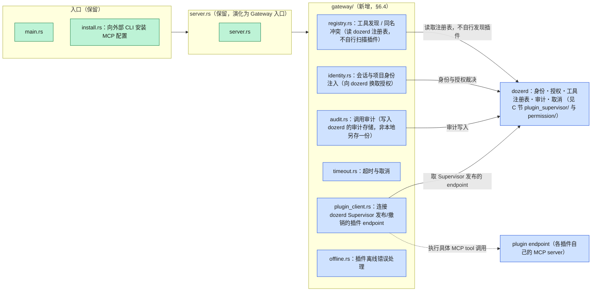

**运行时调用顺序**（与审核意见 2.4 建议一致）：`Agent → dozer-mcp → dozerd`（身份/授权/工具
注册表/审计/取消）`→ plugin endpoint`（执行具体 MCP tool）。插件 endpoint 由 `dozerd` 的
Supervisor 发布和撤销，Gateway 不应自行扫描插件、也不应维护第二份插件生命周期状态。

---

## F. Execution Environment / Decision Service

`dozer-execution-env` 是比 Container 更宽的抽象（§16.6），provider 可插拔；`dozer-decision`
统一 typed contract（Boolean/Choice/Score），Laya 作为可选本地 Provider、以 sidecar 形式
运行，Shadow Mode 记录建议但不改变真实 Workflow（§16.7）。这两个 crate 不对应任何单一面板，
被 Runs（K 节）、Decision Inbox（J 节）等多个面板共同依赖，因此放在基座部分。

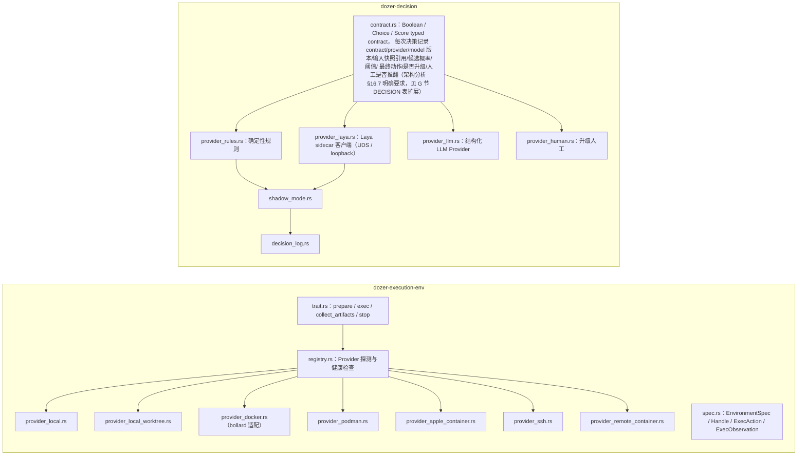

容器不是安全沙箱：默认禁止挂载 Home/`.ssh`/容器 socket，不共享宿主 PID（§16.6）。Laya
输出是 recommendation，不是不可覆写的 truth（§16.7）。

---

## G. 核心 Workflow Kernel 数据库（`dozerd` / `storage/core_db.rs`）

按 §4.2「领域数据应由插件自己的存储持有，核心 daemon 只提供通用托管能力」拆成两层：
`dozerd` 持有跨插件的 Workflow Kernel + 平台表（唯一事实源）；各官方插件持有自己命名空间下
的私有 SQLite（见 W 节）。两层之间只通过 ID 引用（§18.15 数据关联不变量），不跨库外键。

**本节 ER 图是概念模型，不是可直接迁移的物理 schema（回应审核意见 3.7）：** 没有表达复合主键、
唯一约束、环检测、乐观锁、软删除/归档策略等物理层细节（例如 `TASK_DEPENDENCY` 需要
`(task_id, depends_on_task_id)` 复合唯一约束并做环检测；`WORKTREE.task_id` 需要表达"一个
Task 最多一个活动 Worktree"这类条件约束；`PLUGIN_PERMISSION` 需要表达 deny 优先级和授权来源）。
进入实现阶段前需要单独产出一版物理 migration schema。

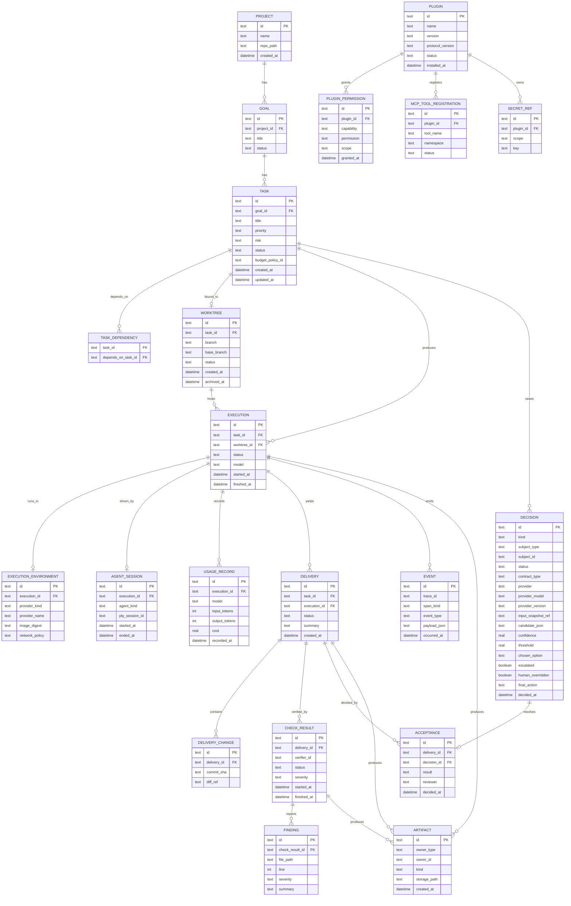

- `TASK.status`：draft → ready → running → blocked → verifying → awaiting_acceptance →
  accepted/rejected/cancelled（§16.2）。**`TASK` 是 Task 状态的唯一事实源**：Todo 插件不维护
  自己的 Task 状态字段，只通过核心 Task API 读写（详见 L 节，回应审核意见 2.1）。
- `EXECUTION.status`：queued → starting → running → waiting →
  completed/failed/cancelled/timed_out（§16.2）
- `DELIVERY.status`：assembling → ready → checking → passed/failed →
  accepted/rejected（§16.2）
- **`EVENT` 是 append-only 审计事件日志（Audit Log），不是 Event Sourcing 意义上"可确定性重放
  出 Goal/Task/Execution/Delivery 当前状态"的权威数据源**（回应审核意见 2.2：原版同时暗示两种
  语义，这里明确选边）。`TASK`/`EXECUTION`/`DELIVERY` 等关系表各自是自己当前状态的事实源；
  `EVENT` 只回答"发生过什么、什么时候发生的"，用于审计、时间线展示（O 节 Conversations）和问题
  排查，不承担驱动状态机重建的职责。如果未来确实要做完整 Event Sourcing（按聚合重放状态），
  需要另行评估并至少补齐 `aggregate_type`/`aggregate_id`/单聚合递增 `sequence`/
  `event_schema_version`/`correlation_id`/`causation_id`/`actor_type`+`actor_id` 等字段，
  当前版本不做这个假设。
- `DECISION` 字段已按架构分析 §16.7 的要求扩展（`contract_type`/`provider_model`/
  `provider_version`/`input_snapshot_ref`/`candidate_json`/`threshold`/`escalated`/
  `human_overridden`/`final_action`），以支撑 Shadow Mode 评估、Provider 对比和推翻率统计
  （部分回应审核意见 3.5）。仍保留单表而非拆成
  `DECISION_REQUEST`/`DECISION_CANDIDATE`/`DECISION_EVALUATION`/`DECISION_RESOLUTION`
  四表——审核意见的拆分方案更规范，但在候选决策 Provider 数量、并发评估需求明确之前，单表
  加宽字段足够支撑讨论用途；拆表留给物理 schema 阶段判断。
- `ARTIFACT` 用 `owner_type + owner_id` 多态引用 `EXECUTION`/`DELIVERY`/`CHECK_RESULT`
  三类关系（回应审核意见 3.6）：数据库层面无法用普通外键保证完整性，这里明确选择"应用层 +
  事件投影保证完整性"这条路径，而不是拆成 `EXECUTION_ARTIFACT`/`DELIVERY_ARTIFACT`/
  `CHECK_RESULT_ARTIFACT` 三张关联表——概念模型阶段多态引用更省样板；进入物理 schema 时如果
  发现按 owner 类型做索引/清理策略差异很大，再拆表。
- `DECISION.provider`：rule / laya / llm / human，对应 §16.7 Decision Service 的四个
  Provider（`contract.rs` 见 F 节）。

---

# 面板 / 组件（Panels & Components）

以下每个小节对应架构分析 §17-§18 的一个面板或新页面。除 Mission/Delivery/Decision Inbox/Runs
四个是 Host 原生页面（不拆插件）外，其余均以进程外插件形式挂在 Plugin Runtime 下（A 节
`L6dir`）。

## H. Mission / Overview

架构分析 §17.1：新增项目级控制台，集中回答当前 Goal 与进度、正在运行/阻塞/失败的
Execution、等待人类处理的 Decision、等待验收的 Delivery、当前预算/风险/Check 摘要、
Worktree 冲突和插件异常——是行动入口，不是展示更多统计数据的 Dashboard。属于 Host 原生页面，
数据来自 G 节核心库的聚合查询，不持有自己的存储。

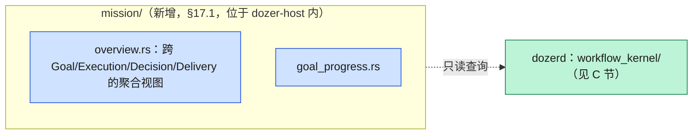

---

## I. Delivery / Acceptance

架构分析 §17.2：V2 最关键的新页面，集中展示 Task 与验收标准、Agent 交付摘要、Worktree/diff/
commits、测试与 Verifier 结果、Code Health 变化、Browser 截图/录像/trace、Token/时间/模型
投入、未验证事项与风险，并提供接受/拒绝/要求修改/合并操作——目的是不需要人类在 Files、
Conversation、Usage、Code Health 和 Browser 之间手工拼接证据。属于 Host 原生页面。

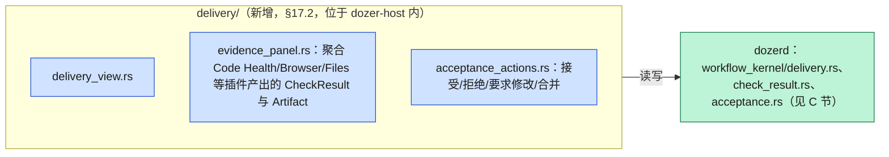

---

## J. Decision Inbox

架构分析 §17.3：统一汇集 Agent 请求澄清、权限申请、预算超限、多方案选择、Worktree 冲突、
验收与合并请求、高风险操作，支持关联对象、期限、候选项、推荐理由、最终选择和审计历史。属于
Host 原生页面。

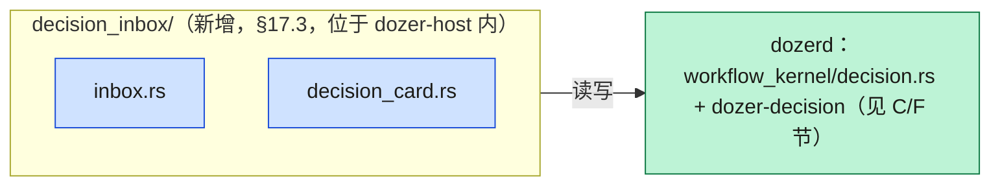

---

## K. Runs / Executions（原 Agent 面板）

架构分析 §18.1：关注点从"有哪些 Agent 终端"转为"哪些工作正在执行"。新增 Goal/Task、
Worktree、分支和 cwd，Agent/模型/启动参数/当前执行阶段，最近工具/MCP 调用/Token/耗时/预算，
文件修改范围/阻塞原因/权限请求，暂停/继续/终止/重试/换 Agent 接管，创建 Reviewer
Execution，跳转 Conversation/Diff/Delivery。必须区分：Agent 是执行者，Session 是连接，
Execution 是一次工作尝试，Task 是工作目标——进程退出不等同于任务完成。属于 Host 原生页面
（沿用现有 `agent_session/` 会话基础设施，见 C 节）。

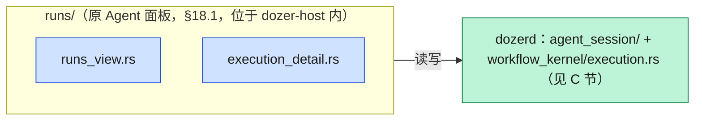

---

## L. Todo → Tasks

架构分析 §11.3 / §18.2 第二试点：验证完整 CRUD、实时事件/badge、声明式 UI 或简单 Web UI、
MCP 写工具、项目级数据隔离，以及与其他未知插件的 Agent 编排。Task 在现有待办字段上增加
Goal/描述/优先级/风险、验收标准、依赖和阻塞关系、预算与 Agent/模型策略、Worktree 策略、
Verifier 列表、当前/历史 Execution、Delivery 与 Acceptance 状态；视图可提供列表/看板/依赖图/
正在运行/等待验收/返工历史；"指派 Agent"应创建 Execution，而不是只向终端写入文本。

**Task 唯一事实源裁决（回应审核意见 2.1，高优先级问题）：** 原版让 `dozer-plugin-todo` 拥有
完整私有 Task 表（`todos`/`todo_categories`），与 G 节核心库的 `TASK` 表形成两个事实源——这与
架构分析 §16.2「Task 是插件协作的公共语言」以及 §18.2「Todo 面板 → Tasks」的裁决直接冲突：
若两张表都能写状态，会出现 Task ID/状态机/权限规则重复、插件库与核心库需要双写或异步同步、
插件离线或卸载后 Task 状态不可恢复、Todo/Agent/Delivery/Decision 对"当前任务状态"判断不一致
等问题。本轮采纳该修改建议：

- **核心 `Task Service`（`dozerd::workflow_kernel::task.rs`，见 C/G 节）是 Task 唯一写入入口
  和事实源。**
- Todo 插件只贡献 Task 的 UI、命令、MCP tools、分类方式和视图偏好，不再持有 Task 本体。
- `todo.list`/`todo.add`/`todo.assign`/`todo.complete` 等 MCP tools 调用核心 Task API（经
  `dozer-protocol` 的 Workflow Kernel RPC），不直接写插件私有表。
- 插件私有 SQLite 只保存分类、排序、过滤器等**扩展数据**，通过 `task_id` 引用核心
  `TASK.id`（跨库，无外键约束，见 W 节 `TODO_TASK_PREFS`）。

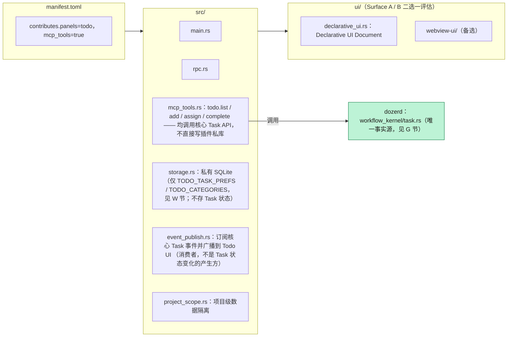

---

## M. Project → Project Context（含 Shared Memory）

架构分析 §18.3：Project 成为"项目如何被 Agent 理解和治理"的真相源——项目身份/仓库/remote、
README/项目文档、Shared Memory、项目规则和 Agent instructions、默认 Agent/模型/预算/
Verifier、Worktree 和验收策略、环境启动方式/Secret 引用/已启用插件。Shared Memory 进一步
增加类型（事实/决策/偏好/反馈/参考/临时状态）、来源、证据、作用域、历史、过期、冲突、敏感
标记、读写审计，以及从 Delivery 自动提炼后由用户确认的入口。

现状：`crates/dozer-app/src/extensions/project/` 承担当前 Project 面板；身份类数据落在
`dozerd::project::projects.rs`（保留，见 C 节）。目标插件为 `dozer-plugin-memory`（Shared
Memory 部分，见 W 节 `MEMORY_*`）+ Project Context 的治理型视图/规则/策略部分（是否单独拆
`dozer-plugin-project` 还是仍作为 Host 原生页面，属于架构分析 §8 显式未决项，不在本图擅自
定死）。

---

## N. Code Health → Quality Governance

架构分析 §11.2 / §18.6，推荐的首个试点：核心分析已独立为 `dozer-codehealth`，适合验证
Job/Progress/Cancel、WebView Surface 与 MCP 长任务注册。从静态报告升级为：Task 前基线与
Worktree 当前结果、相对目标分支的新增/修复/恶化 Finding、Finding 归属文件与 Execution、
Finding 转 Task、Quality Gate/趋势/有理由的豁免、Reviewer Agent 结论、插件式扫描器；必须
输出标准 `CheckResult` 进入 Delivery/Acceptance，不能只存在于自己的面板。通过标准：修改并
重启插件不重新构建 Host，Host 可恢复面板，Agent 可调用其工具。

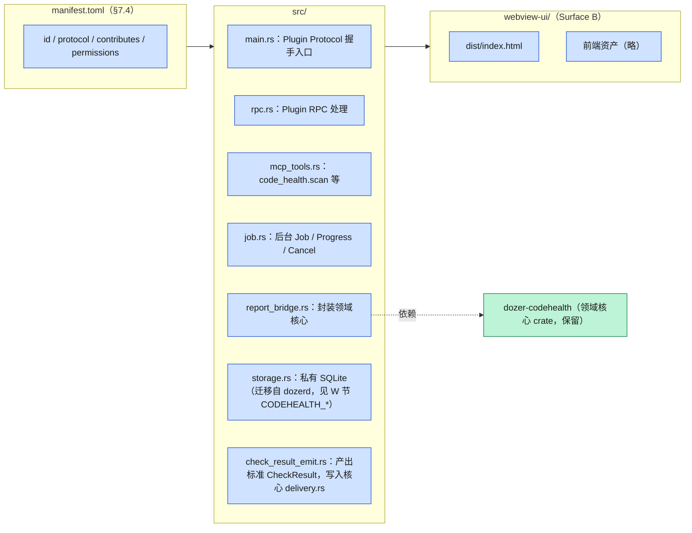

---

## O. Conversations → Execution Audit

架构分析 §18.4：时间线统一展示 Prompt/回复和 summary、Tool/MCP call、文件修改和命令执行、
权限申请和 Memory 读写、Task 状态变化/Check/Decision、Agent handoff；支持按
Project/Goal/Task/Execution/Agent/Tool/风险查询，从事件跳转到对应文件/diff/Task/Artifact，
并比较同一 Task 的多个 Execution；自动摘要不能取代原始证据。

现状：`crates/dozer-app/src/extensions/conversations.rs` + `crates/dozer-app/src/conversation.rs`
承担当前面板；`dozerd` 侧由 `session_summary.rs`/`session_summary_backfill.rs`/
`transcripts/{mod,parse,scan}.rs` 支撑（保留，见 C 节 `legacy_mod`）。目标插件为
`dozer-plugin-conversation-audit`。

**原始数据归属（部分回应审核意见 3.4）：** 原始证据是磁盘上的 Agent transcript 文件本身，
以及 G 节核心库的 `EVENT` 审计日志——这两者是"发生过什么"的权威来源。插件私库的
`CONVERSATION_TURNS`/`CONVERSATION_SESSION_SUMMARIES`（见 W 节）是对这些原始数据的**可重建
索引/摘要缓存**，不是唯一副本；插件卸载、禁用或私库损坏不影响核心 `EXECUTION`/`EVENT` 的
可追溯性，只是失去了检索/摘要的便利层，需要时可以重新解析 transcript 文件重建。

---

## P. Usage → Cost & Efficiency

架构分析 §18.5：统计维度扩展到 Goal/Task/Execution、Agent/模型、插件/tool，以及成功/失败/
被拒绝和最终是否产生 accepted Delivery；新增指标：单 Task/accepted Delivery 成本、失败和
重试浪费、模型效率差异、Token 与质量变化关系、人类等待时间；进一步通过 Budget Engine 支持
阈值、超限暂停、模型降级和继续授权。

现状：`crates/dozer-app/src/extensions/usage/` 承担当前面板。目标插件为
`dozer-plugin-usage`。原始 `USAGE_RECORD` 已在 G 节核心库（按 `execution_id` 关联），Usage
插件不需要另开一张私有原始记录表，只需要在自己的私库中保存**聚合视图/预算阈值配置**这类
衍生数据（W 节未单独列出 `USAGE_*` 表，即是此意，不是遗漏）。

---

## Q. Browser → Browser Test & Evidence

架构分析 §18.7：保留手动浏览，同时增加本地服务发现与启动、测试用例/步骤和重放、Agent 驱动
的导航/点击/输入、DOM/Console/Network/Accessibility 检查、多 viewport/截图/录像/trace 和
基线对比、失败步骤定位；Browser Run 归属 Task/Execution，证据进入 Artifact Store，断言进入
`CheckResult`，并在 Delivery 页面直接参与验收。

现状：`crates/dozer-app/src/extensions/browser.rs` 承担当前面板（手动浏览 + 书签，
`dozerd::bookmarks.rs` 保留至迁移，见 C 节）；`preview/`、`chrome/` 的 WebView 基础设施被复用
（见 B 节）。**Agent 可驱动的浏览器自动化（CDP）当前仓库尚未实现，已确认推迟到下一期**（见
B 节 `ch_cdp` 说明与项目记忆），本节的"Agent 驱动"能力属于规划中，不是现状。目标插件为
`dozer-plugin-browser`。

---

## R. Files → Worktree-aware Changes

架构分析 §18.8：新增当前主工作区/worktree 身份、Agent 修改标记及来源 Execution、未提交/
已提交/冲突状态、与目标分支比较、多 Execution 修改相同区域的预警、从文件跳转相关
Conversation/Task、Delivery snapshot 只读查看、敏感文件和受保护路径提示。**继续坚持查看和
验收优先，不演化成通用人工编码器**（呼应本仓库 CLAUDE.md 关键裁决：预览优先"渲染/查看"而非
"编辑"）。

现状：`crates/dozer-app/src/extensions/files/` 承担当前面板。目标插件为
`dozer-plugin-files`（§18.8/§18.9 明确"查看/验收优先"定位，不演化为通用编辑器）。

---

## S. Git Log / History → Integration

架构分析 §18.9 / §18.12：新增 Commit 与 Task/Execution/Delivery 关联、Worktree 分支、
ahead/behind、目标分支变化、rebase/merge readiness、冲突预测、Check 状态、合并门禁、回滚点
和多 Delivery 集成队列；复杂 Git 写操作统一经过 Decision/Approval（J 节）。Git/File History
不再只回答"文件何时变化"，还要回答谁/哪个 Agent/属于哪个 Task/Execution/为什么修改/进入哪次
Delivery/是否被接受或后来回滚，并可跳转对应 Conversation 事件——本版不单独为 History 开一个
面板小节，并入这里，因为它是 Git Log 与 Files（R 节）共享的横切能力，不对应独立 crate。

现状：`crates/dozer-app/src/extensions/git_log.rs` 承担当前面板。目标插件为
`dozer-plugin-gitlog`（同样"查看/验收优先"，见 A 节说明）。

---

## T. SSH → Environments

架构分析 §18.10：从远程终端升级为远程执行环境管理——环境身份与标签、主机能力、项目映射、
Remote Agent/Worktree、连接健康、Secret scope、命令和文件传输审计、端口转发、环境指纹、
Task/Execution 绑定和高风险操作确认。SSH 是权限、长连接、PTY 和资源回收模型的压力测试样本
（架构分析 §11.4 第三试点）。

现状：`crates/dozer-app/src/extensions/ssh/` 承担当前面板。目标插件为 `dozer-plugin-ssh`。

---

## U. Database → Data Workspace

架构分析 §18.11：新增数据源作用域/环境标签、只读/读写模式、Schema Context Provider、查询
历史和 Agent 查询审计、敏感列遮蔽、行数/成本限制、写操作确认、Transaction Preview、查询
结果 Artifact 和测试前后数据验证；默认只读，写入与 DDL 需要显式权限。

现状：`crates/dozer-app/src/extensions/database/` 承担当前面板。目标插件为
`dozer-plugin-database`（架构分析 §18.16 正式迁移顺序中排最后，见 A 节）。

---

## V. Plugin Manager / Settings / Footbar

架构分析 §17.4：放入 Platform/Settings，而非默认占用 Rail，展示安装/启用范围/版本/兼容状态、
权限及其最近使用记录、已注册 Surface/Commands/MCP tools、CPU/内存/日志和崩溃状态、重启/
禁用/升级/回滚、开发模式与协议 Inspector。数据完全来自 C 节 `plugin_supervisor/` 与
`permission/`，不需要自己的存储，因此没有独立 crate/插件，是 Host `Settings` 页面上的一个
子页。

Settings（§18.13）与 Footbar（§18.14）同样是 Host 横切能力，不单独展开：Settings 区分
Host/Workspace/插件/权限/Agent provider/Model policy/Secret/默认预算/默认 Verifier/
Plugin API 开发模式/数据保留和隐私；Footbar 只显示必须持续感知的跨平台状态（运行中
Execution、等待 Decision/Acceptance、插件异常、后台 Job、预算预警、Worktree 冲突、
daemon/MCP 状态），详细信息点击进入对应页面。两者都复用已有的 `extensions/settings.rs`、
`extensions/footbar.rs`（保留，随插件化推进逐步接入新的数据源）。

---

## W. 插件私有数据库总览

按 §4.2「领域数据应由插件自己的存储持有，核心 daemon 只提供通用托管能力」拆成两层：G 节的
核心库持有跨插件的 Workflow Kernel + 平台表（唯一事实源）；各官方插件持有自己命名空间下的
私有 SQLite。两层之间只通过 ID 引用，不跨库外键。

**Todo 私库结构已按 L 节裁决调整**：不再有独立的 `TODO_TODOS`（会与核心 `TASK` 重复事实
源），改为 `TODO_TASK_PREFS`，只存分类/排序/视图偏好并引用核心 `task_id`。

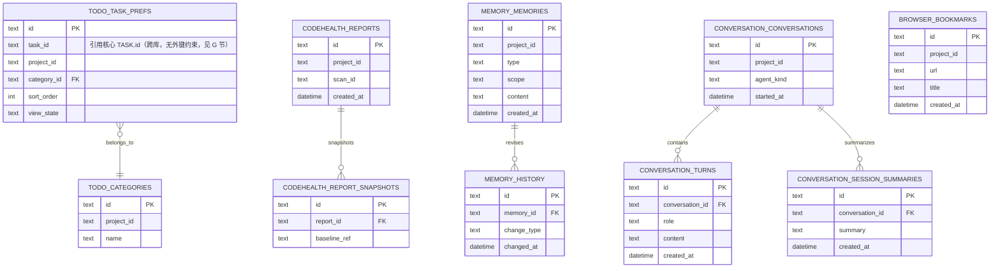

归属：`TODO_*`（已调整）→ `dozer-plugin-todo`（见 L 节）；`CODEHEALTH_*` →
`dozer-plugin-codehealth`（见 N 节）；`MEMORY_*` → `dozer-plugin-memory`（§4.4，五个
scope：workspace/project/task/agent/user，见 M 节）；`CONVERSATION_*` →
`dozer-plugin-conversation-audit`（**是原始 transcript/EVENT 的可重建索引，不是唯一副本**，
见 O 节回应审核意见 3.4）；`BROWSER_BOOKMARKS` → `dozer-plugin-browser`（见 Q 节）。这些表
现今已存在于 `dozerd` 单体 SQLite 中（`todos`、`code_health_reports`、`memories`、
`conversations`、`bookmarks` 等），V2 目标是随各插件迁移逐一拆出，不做一次性批量搬迁
（§11.5）；拆出时 `todos` 表需要按 L 节裁决做结构调整，不是原样平移。

---

## X. 审核意见采纳情况（本次修订说明）

审核意见共 13 条准入条件、多条高/中优先级问题。以下按审核意见原编号逐条说明处理方式；
「不符实际未采纳」的具体断言列在最后，其余均在上文相应小节采纳或部分采纳。

**已采纳（结构或内容修改）：**

- 2.1 Todo/Task 双事实源 → 核心 Task 唯一事实源裁决（L 节）。
- 2.2 EVENT 语义矛盾 → 明确定为审计日志而非 Event Sourcing 重放源（G 节）。
- 2.3 Plugin Runtime 权威不清 → 明确 dozerd 是唯一 authority，Host 只做请求+展示（B 节）。
- 2.4 MCP Gateway 绕过 Supervisor → 补充 Gateway→dozerd 的运行时调用关系（E 节）。
- 3.1 Workspace 对象缺失 → 明确裁决为 Host 会话态、暂不入库，而非无声省略（C 节）。
- 3.2 Platform Services 未完整映射 → 补充 Plugin Storage/Job/File/Git/Notification/
  MCP Gateway 控制面节点，标记为待实现但保留在目标结构中（C 节）。
- 3.3 Contribution Registry 类型不全 → 文字补全 §16.3 全部贡献类型（B 节）。
- 3.4 Conversation/Usage 数据归属 → 明确原始证据在磁盘 transcript + 核心 EVENT，插件私库是
  可重建索引（O/P/W 节）。
- 3.5 Decision 结构不足 → 按 §16.7 要求扩展 DECISION 字段（G 节），未采纳拆四表的具体方案
  （见下方「部分采纳」）。
- 3.6 Artifact 多态引用 → 明确记录取舍（应用层保证完整性），未改为关联表（G 节）。
- 3.7 缺乏物理约束 → 明确标注 ER 图为概念模型，列出已知缺口（G 节）。
- 4.1 章节引用失效 → 逐条核对架构分析实际标题并订正或去除虚构编号（D/C 节等）。
- 4.3 现状保留标记不准 → 对照当前仓库重新核对 Micro Host 节点路径（B 节）。
- 4.4 迁移顺序混淆 → 明确区分"纵向试点顺序"与"正式迁移顺序"（A 节）。
- 4.5 Surface 数量表述 → 明确 Surface D(None) 含义（B 节）。
- 4.6 dozer-protocol 职责过宽 → 补充版本策略取舍说明（D 节）。
- 结构性要求「按基座+面板重新组织」→ 本次全篇重排（见文档整体结构）。

**部分采纳（认可问题，但未照搬建议方案）：**

- 3.5 未拆分 `DECISION_REQUEST/CANDIDATE/EVALUATION/RESOLUTION` 四表，理由见 G 节：讨论
  草图阶段加宽单表字段已够用，拆表留给物理 schema 阶段按实际并发/多候选需求判断。
- 4.2 箭头语义未拆成三张独立图，理由见文首「如何阅读本图」：本轮只加文字澄清，留作下一轮
  候选项，因为拆图对当前讨论阶段的性价比不高。

**未采纳（与仓库实际不符的具体断言，非否定问题方向）：**

- 4.3 举例中的 `app/message.rs`、`app/update.rs`「不存在」——经核对，这两个文件在当前仓库
  确实存在（`crates/dozer-app/src/app/message.rs`、`update.rs`），审核意见此处判断有误，
  未据此修改这两个节点的标记；同一条问题里 `workspace/tabs.rs`、
  `workspace/panel_container.rs`、`term/pty_view.rs`、`chrome/cdp_driver.rs`
  确认不存在，已按审核意见修正（见 B 节）。这说明"现状保留"标记不准的**问题方向成立**，
  但**具体举例需要逐条核实，不能整体照搬**。

---

来源：`docs/dozer-v2/dozer-v2架构分析.md`、`docs/dozer-v2/dozer-v2开源生态调研.md`
（2026-09-24）、`docs/dozer-v2/dozer-v2静态结构图-审核意见.md`（2026-09-25）。本图是对分析
文档的结构化映射，用于讨论落点；crate/文件命名为基于文档描述的合理推演，尚未经过 spec /
plan 批准，实施前仍需按项目现实的 SDD 流程分别评审。
