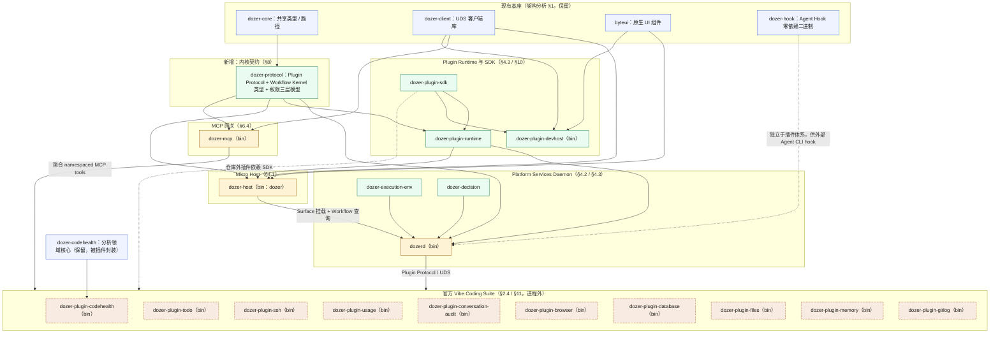
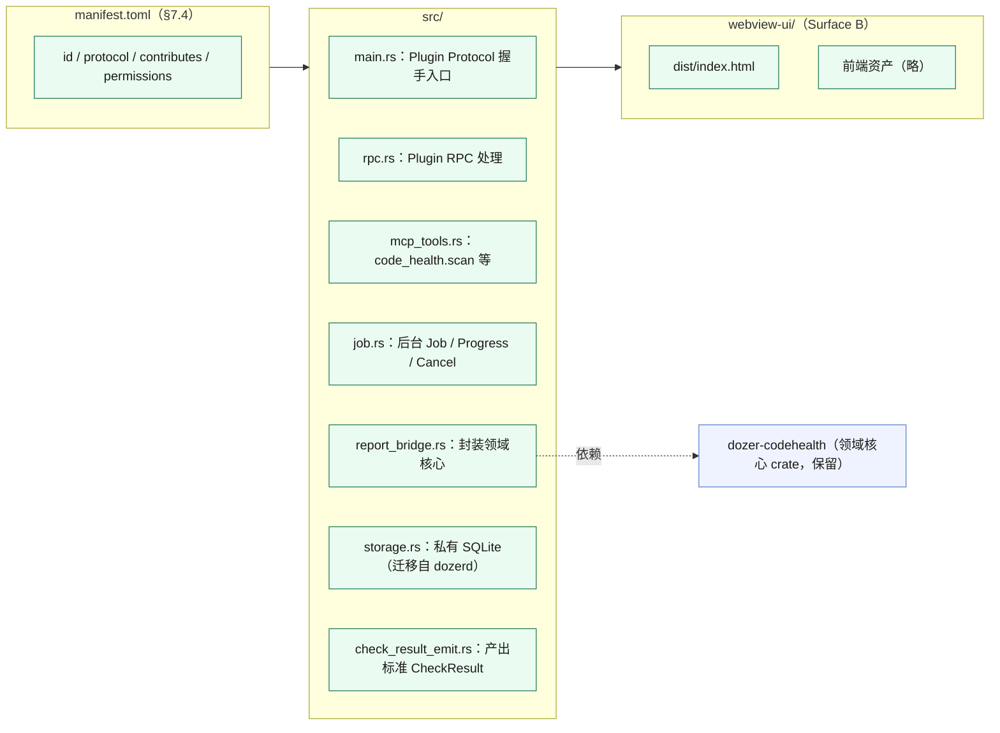
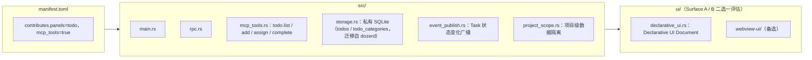
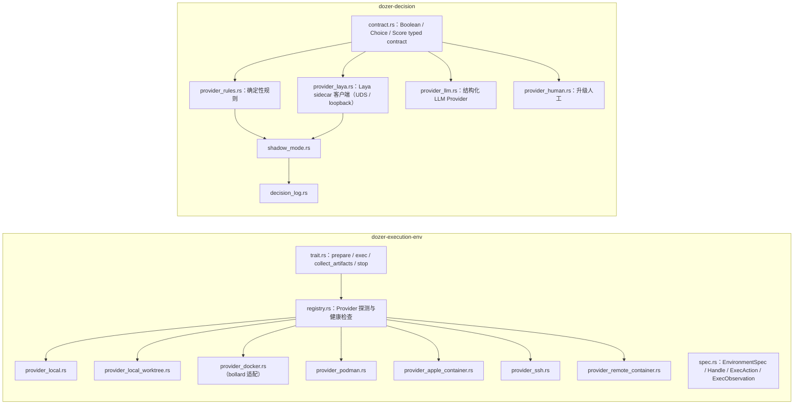
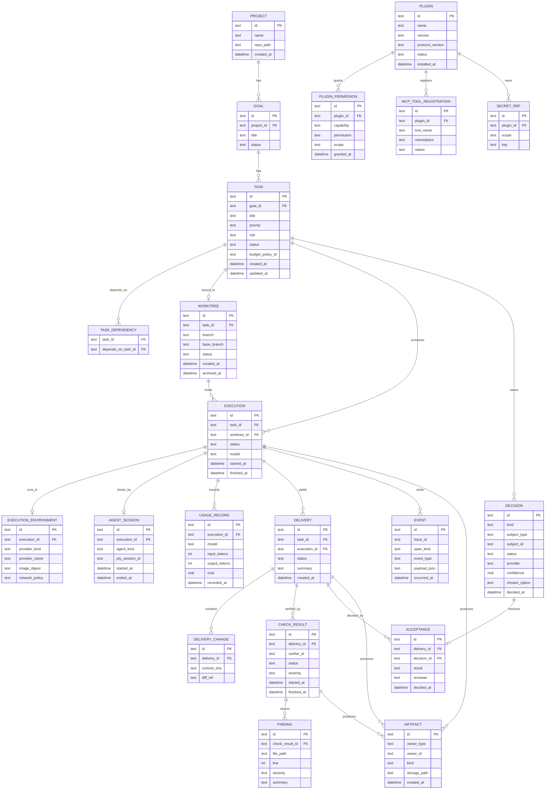
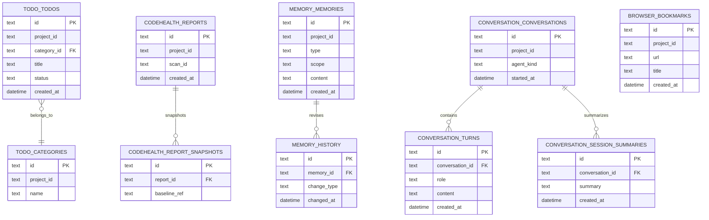

# Dozer V2 静态结构图

> 文档性质：对 `dozer-v2架构分析.md` 与 `dozer-v2开源生态调研.md` 的结构化映射，用于讨论落点，
> 不是已批准的实现规格。crate/模块/文件命名为基于两份文档描述的合理推演。
> 整理日期：2026-09-24。也发布为 Claude Artifact（交互版，浅色卡片背景保证 Mermaid 图在深浅主题下都可读）：
> https://claude.ai/artifact/Q25RQ9iAWMJe2kyKZFFqjv

细化到 package / crate / module / 文件级，并附数据库结构。两层拆分原则见架构分析 §4.2：
「领域数据应由插件自己的存储或 namespaced service 持有，核心 daemon 只提供通用托管能力」。

## 目录

- [A. Workspace Crate 全景](#a-workspace-crate-全景)
- [B. Micro Host（dozer-host，原 dozer-app）](#b-micro-host--dozer-host原-dozer-app)
- [C. Platform Services Daemon（dozerd）](#c-platform-services-daemon--dozerd)
- [D. dozer-protocol（内核契约）](#d-dozer-protocol--内核契约)
- [E. MCP Gateway（dozer-mcp）](#e-mcp-gateway--dozer-mcp)
- [F. 官方插件试点 1：Code Health](#f-官方插件试点-1--dozer-plugin-codehealth)
- [G. 官方插件试点 2：Todo](#g-官方插件试点-2--dozer-plugin-todo)
- [H. Execution Environment / Decision](#h-dozer-execution-env--dozer-decision)
- [I. 数据库结构](#i-数据库结构)

节点颜色约定（各图 `classDef`）：蓝 = 现状基本保留；金 = 既有 crate/bin，职责大幅演进；
绿 = V2 全新 crate/模块；橙虚线 = 从现有 `extensions::*` 拆出的进程外插件，或待迁出的 legacy 模块。

---

## A. Workspace Crate 全景

V2 目标下的整体 workspace 构成：现有基座保留，`dozer-core` 之上新增 `dozer-protocol` 承载
Plugin Protocol 与 Workflow Kernel 契约；`dozerd`／`dozer-app`／`dozer-mcp` 三个既有 bin
职责大幅演进；官方 Vibe Coding Suite（架构分析 §2.4）以进程外插件形式挂在 Plugin Runtime
之下，通过 Plugin Protocol 和 MCP 两条通道分别对接 Host 与 Agent。

**迁移顺序（§11.2-§11.4，§18.16）：** 不批量搬 crate；先跑通 Code Health → Todo → SSH 三个
纵向试点，再按 Usage → Conversations → Browser → Database 顺序迁移剩余官方插件。
`dozer-plugin-files` 与 `dozer-plugin-gitlog` 保持"查看/验收优先"定位（§18.8/§18.9），
不演化为通用编辑器。

---

## B. Micro Host — `dozer-host`（原 `dozer-app`）

iced Shell 继续承担窗口、Workspace、布局与可信 UI（§7.1）。`extensions/*` 迁出后，Host
新增 Plugin Surface、Contribution Registry 与 §17-§18 的新页面骨架（Mission、
Delivery/Acceptance、Decision Inbox、Runs）。`preview/`、`chrome/` 保留为 WebView/CDP
基础设施，同时被 Plugin Surface 与 `dozer-plugin-browser` 复用。

```mermaid
flowchart LR
  subgraph app_mod["app/（顶层状态机，保留）"]
    direction TB
    app_message["message.rs"]
    app_update["update.rs"]
    app_view["view.rs"]
    app_sub["subscription.rs"]
  end

  subgraph workspace_mod["workspace/（Rail・Tab・布局，保留）"]
    direction TB
    ws_rail["rail.rs"]
    ws_tabs["tabs.rs"]
    ws_layout["layout.rs"]
    ws_panel["panel_container.rs"]
  end

  subgraph platform_mod["platform/（窗口・原生输入，保留）"]
    direction TB
    pf_window["window.rs"]
    pf_events["window_events.rs"]
    pf_overlay["overlay_window.rs"]
    pf_input["native_input.rs"]
  end

  subgraph surfaces_mod["surfaces/（新增，§7.3-§7.5）"]
    direction TB
    sf_lifecycle["lifecycle.rs"]
    sf_declarative["declarative.rs：Surface A"]
    sf_webview["webview.rs：Surface B"]
    sf_external["external.rs：Surface C"]
  end

  subgraph registry_mod["registry/（新增，§16.3）"]
    direction TB
    reg_contribution["contribution.rs"]
    reg_panel["panel_registry.rs"]
    reg_command["command_registry.rs"]
  end

  subgraph supervisor_mod["supervisor_client/（新增，§4.3）"]
    direction TB
    sup_client["plugin_client.rs"]
    sup_permission["permission_prompt.rs"]
  end

  subgraph mission_mod["mission/（新增，§17.1）"]
    direction TB
    ms_overview["overview.rs"]
    ms_goal["goal_progress.rs"]
  end

  subgraph delivery_mod["delivery/（新增，§17.2）"]
    direction TB
    dv_view["delivery_view.rs"]
    dv_evidence["evidence_panel.rs"]
    dv_actions["acceptance_actions.rs"]
  end

  subgraph decision_mod["decision_inbox/（新增，§17.3）"]
    direction TB
    di_inbox["inbox.rs"]
    di_card["decision_card.rs"]
  end

  subgraph runs_mod["runs/（原 Agent 面板，§18.1）"]
    direction TB
    rn_view["runs_view.rs"]
    rn_detail["execution_detail.rs"]
  end

  subgraph theme_assets_mod["theme/ · assets/ · term/ · tabular/（保留）"]
    direction TB
    th_tokens["theme/tokens.rs"]
    th_byteboy["theme/byteboy2077.rs"]
    as_fonts["assets/fonts.rs"]
    tm_pty["term/pty_view.rs"]
    tb_table["tabular/table_view.rs"]
  end

  subgraph preview_chrome_mod["preview/ · chrome/（保留，供插件复用）"]
    direction TB
    pv_router["preview/router.rs"]
    pv_html["preview/html_host.rs"]
    ch_cdp["chrome/cdp_driver.rs"]
  end

  app_mod --> workspace_mod
  workspace_mod --> surfaces_mod
  workspace_mod --> mission_mod
  workspace_mod --> delivery_mod
  workspace_mod --> decision_mod
  workspace_mod --> runs_mod
  surfaces_mod --> registry_mod
  registry_mod --> supervisor_mod
  platform_mod --> surfaces_mod
  surfaces_mod -.->|"WebView Surface 复用"| preview_chrome_mod
  app_mod --> theme_assets_mod

  class app_message,app_update,app_view,app_sub,ws_rail,ws_tabs,ws_layout,ws_panel,pf_window,pf_events,pf_overlay,pf_input,th_tokens,th_byteboy,as_fonts,tm_pty,tb_table,pv_router,pv_html,ch_cdp existing
  class sf_lifecycle,sf_declarative,sf_webview,sf_external,reg_contribution,reg_panel,reg_command,sup_client,sup_permission,ms_overview,ms_goal,dv_view,dv_evidence,dv_actions,di_inbox,di_card,rn_view,rn_detail newcrate
  classDef existing fill:#eef3ff,stroke:#5b7fd1,color:#1c1b17;
  classDef newcrate fill:#eafbf2,stroke:#1f7a52,color:#1c1b17;
```

**不再保留：** `extensions/{todo,codehealth,ssh,database,files,project,usage}/` 迁出为进程外
插件（§5.3 运行时插件化），Host 侧只留下 Surface 挂载点与 `supervisor_client/`，不再静态依赖
各领域重型依赖（§1 问题 1）。

---

## C. Platform Services Daemon — `dozerd`

`dozerd` 从"PTY 池 + 会话存活"扩展为 Workflow Kernel 与 Plugin Supervisor 的持有者
（§4.2 / §16.2），但明确不再吸收领域协议：`memory.rs`／`todo.rs`／`code_health.rs` 等按
§4.2「领域数据应由插件自己的存储持有」迁出到对应插件的私有 SQLite（见 §I 数据库结构）。

```mermaid
flowchart LR
  subgraph server_mod["server/（保留）"]
    direction TB
    sv_main["main.rs"]
    sv_server["server.rs"]
    sv_registry["registry.rs"]
  end

  subgraph project_mod["project/（保留）"]
    direction TB
    pj_projects["projects.rs"]
  end

  subgraph session_mod["agent_session/（保留 + 扩展）"]
    direction TB
    ag_session["session.rs"]
    ag_store["agent_session_store.rs（新增）"]
    ag_headless["headless_agent.rs"]
    ag_default["default_agent_config.rs"]
    ag_ring["ring.rs"]
  end

  subgraph supervisor_mod["plugin_supervisor/（新增，§4.3）"]
    direction TB
    ps_manifest["manifest.rs"]
    ps_handshake["handshake.rs"]
    ps_lifecycle["lifecycle.rs"]
    ps_heartbeat["heartbeat.rs"]
    ps_surface["surface_binding.rs"]
  end

  subgraph worktree_mod["worktree/（新增，§16.4）"]
    direction TB
    wt_manager["manager.rs"]
    wt_git["git_ops.rs"]
    wt_reconcile["reconcile.rs"]
    wt_owner["ownership.rs"]
  end

  subgraph kernel_mod["workflow_kernel/（新增，§16.2）"]
    direction TB
    wk_goal["goal.rs"]
    wk_task["task.rs"]
    wk_execution["execution.rs"]
    wk_delivery["delivery.rs"]
    wk_check["check_result.rs"]
    wk_artifact["artifact.rs"]
    wk_decision["decision.rs"]
    wk_acceptance["acceptance.rs"]
    wk_state["state_machine.rs"]
    wk_event["event_log.rs：append-only 重放"]
  end

  subgraph verifier_mod["verifier_runtime/（新增，§16.4）"]
    direction TB
    vr_runner["runner.rs"]
    vr_command["command_verifier.rs"]
    vr_registry["registry.rs"]
  end

  subgraph budget_mod["budget_policy/（新增，§16.4）"]
    direction TB
    bp_engine["engine.rs"]
    bp_threshold["thresholds.rs"]
  end

  subgraph permission_mod["permission/（新增，§9 / §4.9）"]
    direction TB
    pm_capability["capability.rs"]
    pm_permission["permission.rs"]
    pm_scope["scope.rs"]
    pm_broker["broker.rs"]
    pm_secret["secret_store.rs"]
  end

  subgraph eventbus_mod["event_bus/（新增，§4.2）"]
    direction TB
    eb_bus["bus.rs"]
    eb_sub["subscription.rs"]
    eb_backpressure["backpressure.rs"]
  end

  subgraph context_mod["context_service/（新增，§16.4）"]
    direction TB
    cx_project["project_context.rs"]
    cx_memory["memory_bridge.rs"]
    cx_history["history.rs"]
  end

  subgraph storage_mod["storage/（新增：核心库）"]
    direction TB
    st_core["core_db.rs：Workflow Kernel + 平台表"]
  end

  subgraph legacy_mod["待迁出至插件私有存储（§11.5）"]
    direction TB
    lg_memory["memory.rs → dozer-plugin-memory"]
    lg_todo["todo.rs / todo_category.rs → dozer-plugin-todo"]
    lg_codehealth["code_health.rs → dozer-plugin-codehealth"]
    lg_bookmarks["bookmarks.rs → dozer-plugin-browser"]
    lg_summary["session_summary.rs / backfill.rs → dozer-plugin-conversation-audit"]
    lg_transcripts["transcripts/{mod,parse,scan}.rs"]
    lg_ide["ide_bridge.rs / shell_integration.rs"]
    lg_poller["task_poller.rs / task_processor.rs"]
  end

  server_mod --> supervisor_mod
  server_mod --> kernel_mod
  supervisor_mod --> worktree_mod
  worktree_mod --> kernel_mod
  kernel_mod --> verifier_mod
  kernel_mod --> budget_mod
  kernel_mod --> eventbus_mod
  kernel_mod --> storage_mod
  permission_mod --> supervisor_mod
  permission_mod --> kernel_mod
  context_mod --> kernel_mod
  session_mod --> kernel_mod
  legacy_mod -.->|"迁移进行中，§11.5 不批量搬"| storage_mod

  class sv_main,sv_server,sv_registry,pj_projects,ag_session,ag_headless,ag_default,ag_ring existing
  class ag_store,ps_manifest,ps_handshake,ps_lifecycle,ps_heartbeat,ps_surface,wt_manager,wt_git,wt_reconcile,wt_owner,wk_goal,wk_task,wk_execution,wk_delivery,wk_check,wk_artifact,wk_decision,wk_acceptance,wk_state,wk_event,vr_runner,vr_command,vr_registry,bp_engine,bp_threshold,pm_capability,pm_permission,pm_scope,pm_broker,pm_secret,eb_bus,eb_sub,eb_backpressure,cx_project,cx_memory,cx_history,st_core newcrate
  class lg_memory,lg_todo,lg_codehealth,lg_bookmarks,lg_summary,lg_transcripts,lg_ide,lg_poller legacy
  classDef existing fill:#eef3ff,stroke:#5b7fd1,color:#1c1b17;
  classDef newcrate fill:#eafbf2,stroke:#1f7a52,color:#1c1b17;
  classDef legacy fill:#f8ece2,stroke:#a2481b,color:#1c1b17,stroke-dasharray: 3 2;
```

---

## D. `dozer-protocol` — 内核契约

同时被 `dozerd`、`dozer-host`、`dozer-mcp` 与插件 SDK 依赖的唯一契约层：Plugin Protocol
信封与版本协商、Tauri ACL 式三层权限模型（§4.9，deny 优先于 allow）、以及 §16.2 的八个
Workflow Kernel 领域对象。

```mermaid
flowchart LR
  subgraph proto_core["协议基础"]
    direction TB
    pr_version["version.rs：协议版本协商"]
    pr_envelope["plugin_protocol.rs：manifest schema / 请求响应 envelope / 错误码"]
    pr_namespace["mcp_namespace.rs：MCP 工具命名空间"]
  end

  subgraph proto_permission["权限模型（§4.9）"]
    direction TB
    pp_capability["capability.rs"]
    pp_permission["permission.rs"]
    pp_scope["scope.rs"]
    pp_deny["deny_priority.rs：deny 优先裁决"]
  end

  subgraph proto_kernel["Workflow Kernel 领域类型（§16.2）"]
    direction TB
    wk_goal2["goal.rs"]
    wk_task2["task.rs"]
    wk_execution2["execution.rs"]
    wk_delivery2["delivery.rs"]
    wk_check2["check_result.rs"]
    wk_artifact2["artifact.rs"]
    wk_decision2["decision.rs"]
    wk_acceptance2["acceptance.rs"]
  end

  subgraph proto_event["事件与观测 Schema（§4.5）"]
    direction TB
    ev_trace["trace.rs"]
    ev_span["span.rs"]
    ev_usage["usage.rs"]
  end

  proto_core --> proto_kernel
  proto_core --> proto_event
  proto_permission --> proto_core
  proto_kernel --> proto_event
```

未知字段可忽略、新增字段有默认语义（§8.2）；此 crate 不直接暴露 iced/winit/App/Workspace
类型（§7.2）。

---

## E. MCP Gateway — `dozer-mcp`

集中式 MCP server 演化为 Gateway（§6.4）：每个插件注册自己的 namespaced tools（如
`todo.list`、`code_health.scan`），Gateway 统一完成身份注入、授权、发现、审计、超时与冲突
处理。

```mermaid
flowchart LR
  subgraph mcp_entry["入口（保留）"]
    direction TB
    mcp_main["main.rs"]
    mcp_install["install.rs：向外部 CLI 安装 MCP 配置"]
  end

  subgraph mcp_server["server.rs（保留，演化为 Gateway 入口）"]
    direction TB
    mcp_server_rs["server.rs"]
  end

  subgraph mcp_gateway["gateway/（新增，§6.4）"]
    direction TB
    gw_registry["registry.rs：工具发现 / 同名冲突"]
    gw_identity["identity.rs：会话与项目身份注入"]
    gw_audit["audit.rs：调用审计"]
    gw_timeout["timeout.rs：超时与取消"]
    gw_plugin_client["plugin_client.rs：连接各插件 MCP server"]
    gw_offline["offline.rs：插件离线错误处理"]
  end

  mcp_entry --> mcp_server
  mcp_server --> mcp_gateway

  class mcp_main,mcp_install,mcp_server_rs existing
  class gw_registry,gw_identity,gw_audit,gw_timeout,gw_plugin_client,gw_offline newcrate
  classDef existing fill:#eef3ff,stroke:#5b7fd1,color:#1c1b17;
  classDef newcrate fill:#eafbf2,stroke:#1f7a52,color:#1c1b17;
```

---

## F. 官方插件试点 1 — `dozer-plugin-codehealth`

架构分析 §11.2 推荐的首个试点：核心分析已独立为 `dozer-codehealth`，适合验证
Job/Progress/Cancel、WebView Surface 与 MCP 长任务注册。通过标准：修改并重启插件不重新
构建 Host，Host 可恢复面板，Agent 可调用其工具。

---

## G. 官方插件试点 2 — `dozer-plugin-todo`

§11.3 第二试点，验证完整 CRUD、实时事件/badge、声明式 UI 或简单 Web UI、MCP 写工具、
项目级数据隔离，以及与其他未知插件的 Agent 编排。

---

## H. `dozer-execution-env` / `dozer-decision`

ExecutionEnvironment 是比 Container 更宽的抽象（§16.6），provider 可插拔；Decision Service
统一 typed contract（Boolean/Choice/Score），Laya 作为可选本地 Provider、以 sidecar 形式
运行，Shadow Mode 记录建议但不改变真实 Workflow（§16.7）。

容器不是安全沙箱：默认禁止挂载 Home/`.ssh`/容器 socket，不共享宿主 PID（§16.6）。Laya
输出是 recommendation，不是不可覆写的 truth（§4.7 / §16.7）。

---

## I. 数据库结构

按 §4.2「领域数据应由插件自己的存储持有，核心 daemon 只提供通用托管能力」拆成两层：
`dozerd` 持有跨插件的 Workflow Kernel + 平台表（唯一事实源，§4.11 event history 思路）；
各官方插件持有自己命名空间下的私有 SQLite。两层之间只通过 ID 引用（§18.15 数据关联不变
量），不跨库外键。

### I.1 核心 Workflow Kernel DB（`dozerd` / `storage/core_db.rs`）

- `TASK.status`：draft → ready → running → blocked → verifying → awaiting_acceptance →
  accepted/rejected/cancelled（§16.2）
- `EXECUTION.status`：queued → starting → running → waiting →
  completed/failed/cancelled/timed_out（§16.2）
- `DELIVERY.status`：assembling → ready → checking → passed/failed →
  accepted/rejected（§16.2）
- `EVENT` 是 append-only 权威数据源，DAG/状态视图只是投影（§3.5.4 / §4.11，借鉴 Temporal
  event history 思路，不引入 Temporal 本身）
- `DECISION.provider`：rule / laya / llm / human，对应 §16.7 Decision Service 的四个
  Provider

### I.2 插件私有 DB（按插件命名空间隔离，示例）

归属：`TODO_*` → `dozer-plugin-todo`；`CODEHEALTH_*` → `dozer-plugin-codehealth`；
`MEMORY_*` → `dozer-plugin-memory`（§4.4，五个 scope：workspace/project/task/agent/user）；
`CONVERSATION_*` → `dozer-plugin-conversation-audit`；`BROWSER_BOOKMARKS` →
`dozer-plugin-browser`。这些表现今已存在于 `dozerd` 单体 SQLite 中（`todos`、
`code_health_reports`、`memories`、`conversations`、`bookmarks` 等），V2 目标是随各插件
迁移逐一拆出，不做一次性批量搬迁（§11.5）。

---

来源：`docs/dozer-v2/dozer-v2架构分析.md`、`docs/dozer-v2/dozer-v2开源生态调研.md`
（2026-09-24）。本图是对两份分析文档的结构化映射，用于讨论落点；crate/文件命名为基于文档
描述的合理推演，尚未经过 spec / plan 批准，实施前仍需按项目现实的 SDD 流程分别评审。
